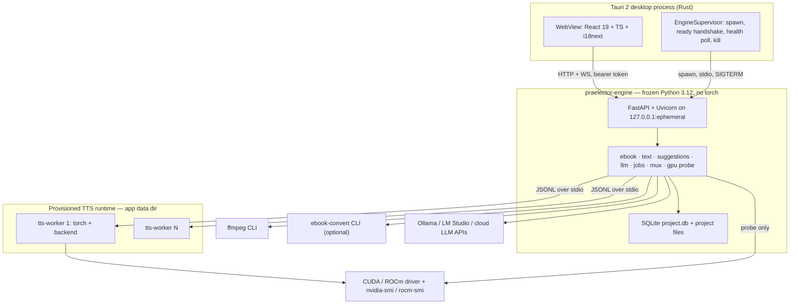

# Architecture

Normative source: [`plan/PLAN.md`](plan/PLAN.md). This page is the short tour —
process topology, the trust boundary, and where state lives.

## Process tiers

Three tiers exist because they have three dependency footprints, and because a
GPU fault must not be able to take the application down with it.



| Tier | Ships in the installer | Why it is separate |
| --- | --- | --- |
| Desktop shell (Rust) | yes | window, sidecar lifecycle, native dialogs, single instance |
| Engine core (Python, PyInstaller onedir) | yes, ~120 MB | everything that does not need `torch` |
| TTS runtime (Python venv, provisioned by a bundled `uv`) | **no** | `torch` + backend, either the `cuda` or the `rocm` flavour. 2.5–4 GB, vendor-exclusive, so it is created on the user's machine on first use (PLAN.md D-04) |

TTS runs in **worker processes**, one per parallel slot, not threads:

1. VRAM is released deterministically when a worker exits, which is what makes
   admission control honest rather than aspirational (GPU-05).
2. A CUDA/HIP OOM or driver fault kills one worker, not the app or the job
   (JB-03, JB-04).
3. The engine core stays torch-free, so CI can exercise the entire job engine
   with the `fake` backend and the installer stays small.
4. Worker count is the scheduler's only knob, so GPU-04 maps directly onto
   "number of live worker processes".

Audio never crosses the worker pipe: the worker writes the WAV to disk and
reports paths and metrics as JSONL. No large payload serialisation, no shared
memory, no local sockets to firewall, and identical behaviour on Windows and
Linux (PLAN.md D-05).

## Trust boundary

The engine is a local HTTP server. Binding `127.0.0.1` alone (NF-01) still
leaves it reachable by any local process and by any web page the user visits, so
three layers are applied:

1. **Port `0`.** The OS assigns an ephemeral port, announced on stdout. Nothing
   is predictable from outside.
2. **Bearer token.** The shell generates 32 random bytes per launch and passes
   them through the **environment** (`PRAELECTOR_TOKEN`), never through argv —
   argv is world-readable in process listings on both Windows and Linux. Every
   request and the WebSocket handshake require
   `Authorization: Bearer <token>`.
3. **Origin allow-list.** A request whose `Origin` header is present must carry
   `tauri://localhost` or `http://localhost:1420`. This is what stops a page in
   the user's browser from driving the engine.

The Tauri CSP allows `connect-src 'self' http://127.0.0.1:* ws://127.0.0.1:*`
and nothing else. There is no telemetry and no other egress except
user-configured LLM endpoints, TTS model downloads and the guided ffmpeg fetch.

The engine returns **error codes, not prose** (`ebook.drm_detected`,
`tts.language_unsupported`). All user-facing text lives in the UI catalogues,
which is what makes IX-01/IX-02 mechanically checkable (PLAN.md D-16).

## Sidecar launch and supervision

```
1. resolve engine command   PRAELECTOR_ENGINE_CMD
                            → <resourceDir>/engine/praelector-engine[.exe]
                            → dev: uv run --project engine praelector-engine
2. spawn                    piped stdout/stderr
                            env: PRAELECTOR_TOKEN, PRAELECTOR_DATA_DIR,
                                 PRAELECTOR_LOG_LEVEL, PRAELECTOR_PARENT_PID
3. ready handshake          engine binds, then writes exactly one line:
                            PRAELECTOR_READY {"port":54321,"pid":12345,
                                              "version":"0.1.0","schema":1}
4. shell reads stdout       30 s budget for the prefix; every other line goes to
                            a rolling 200-line buffer. On timeout: kill the child
                            and show the fatal panel with a "copy diagnostics"
                            button.
5. publish endpoint         port + token into tauri::State; the UI reads them
                            once through the `engine_endpoint` command.
```

Steady state and teardown:

- `GET /v1/health` every 5 s; three consecutive failures trigger a restart.
- Restart backoff 1 s, 2 s, 4 s, 8 s, 16 s. More than 5 restarts in 10 minutes
  stops restarting and shows the fatal panel.
- Shutdown: `POST /v1/shutdown` (pause any running job, checkpoint, close
  SQLite), wait 10 s, then `TerminateProcess`/SIGTERM, then SIGKILL after 5 s.
- **Orphan prevention.** Windows: the child is assigned to a Job Object with
  `JOB_OBJECT_LIMIT_KILL_ON_JOB_CLOSE`. POSIX: the child gets its own process
  group and receives SIGTERM on exit. Portable backstop: the engine polls
  `PRAELECTOR_PARENT_PID` every 5 s and exits if the parent is gone and no job is
  running. TTS workers are children of the engine and are torn down by the same
  logic one level down.
- `tauri-plugin-single-instance` enforces one app instance, which is what makes
  "one project, one job at a time" (JB-06) enforceable. Belt and braces: the
  engine holds an exclusive lock on `<project_dir>/project.lock` and the database
  carries a partial unique index on active jobs.

## Where state lives

SQLite (`<project>/project.db`, WAL) is authoritative for projects, chapters,
blocks, spans, suggestions, voice profiles, jobs and the chunk index (PLAN.md
D-02). Two exceptions are JSON on disk because they must survive a kill
mid-transaction:

| Path | Role |
| --- | --- |
| `<project>/project.json` | manifest, so the Library can list projects without opening databases |
| `<project>/jobs/<id>/job.json` · `plan.jsonl` · `events.jsonl` | **on-disk truth for resume.** On open, `store/reconcile.py` rebuilds the DB chunk index from sidecars; disk wins on conflict (JB-07) |
| `<project>/audio/chunks/<rk[0:2]>/<render_key>.{wav,json}` | content-addressed, immutable once renamed into place (PLAN.md D-07) |

Chunk audio is content-addressed at **project** level rather than job level, so
reordering chapters re-renders nothing and a re-run after edits reuses every
untouched chunk. Identity is the `render_key` (DATA_MODEL.md §9.1), which mixes
text, voice slot, voice content hash, backend, adapter version, model revision,
audio-affecting params, chunker version and audio format version.

Full schema, DDL and JSON shapes: [`plan/DATA_MODEL.md`](plan/DATA_MODEL.md).
Request/response contract: [`plan/OPENAPI_SKETCH.md`](plan/OPENAPI_SKETCH.md).
Sequence diagrams for ingest, prep, record and resume:
[`plan/SEQUENCES.md`](plan/SEQUENCES.md).

## Module map

Engine core (nothing here imports `torch`):

| Package | Responsibility |
| --- | --- |
| `praelector.api.v1` | FastAPI routers, request/response models, WS hub |
| `praelector.domain` | ids, enums, Pydantic entities, hashing, revision logic |
| `praelector.store` | SQLite engine, migrations, repositories, project dir layout, atomic writes, locks |
| `praelector.ebook` | format detect, DRM refusal, EPUB read/write, Calibre, PDF probe, front matter |
| `praelector.text` | normalisation, segmentation, dialogue, gender, numerals, lexicon, prompts |
| `praelector.llm` | provider protocol, router, three clients, secrets, usage counters |
| `praelector.voices` · `praelector.audio` | sample ingest chain, profiles, preview; ffmpeg wrapper |
| `praelector.tts` | backend protocol, descriptor registry, worker client, model cache, license gate |
| `praelector.gpu` | device detection, budget math, VRAM monitor |
| `praelector.jobs` | state machine, prep job, record job, planner, chunker, scheduler, checkpoints, metrics |
| `praelector.mux` | chapter concat, ffmetadata, M4B assembly, partial mux |
| `praelector.runtime` | TTS runtime provisioning via the bundled `uv` |

Layering rules that keep this honest: `api/` contains no logic beyond validation
and delegation; `store/` is the only layer that touches disk or SQLite; `text/`
is pure (no I/O, no network), which is what makes the golden tests cheap;
`tts/` never imports `torch`.

The UI is organised by feature folder (`features/library`, `features/editor`,
`features/job`, …). Feature folders never import from each other; shared code
moves to `components/` or `lib/`, and `lib/api` is the only module allowed to
call `fetch`.
