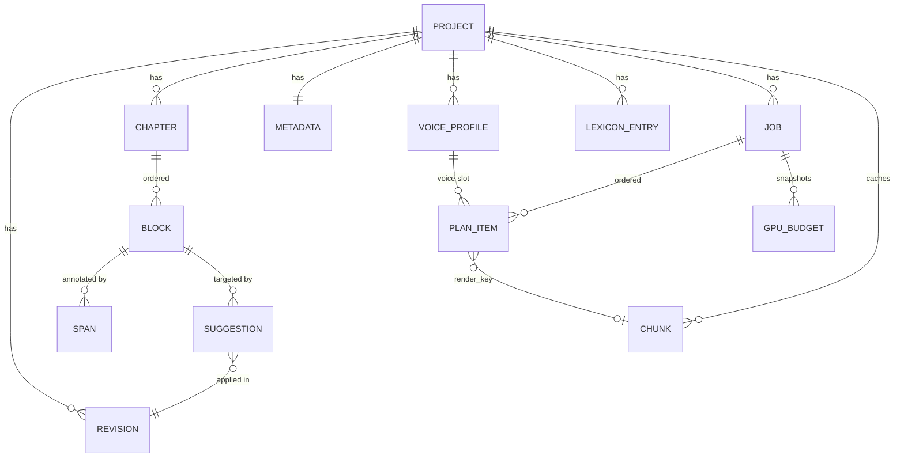

# Praelector — Data Model (v1)

Primary store: **SQLite** at `<project>/project.db` ([D-02](PLAN.md#d-02-sqlite-is-the-primary-store)), WAL mode, accessed through SQLModel/SQLAlchemy 2.0 with Alembic migrations. Two deliberate exceptions are JSON on disk because they must survive a process kill mid-transaction:

- `jobs/<job_id>/job.json`, `plan.jsonl`, `events.jsonl`
- `audio/chunks/**/<render_key>.json` chunk sidecars (JB-02)

On project open, `store/reconcile.py` rebuilds the `chunk` table from sidecars. **Disk wins** on conflict. This is what makes JB-07 recovery real rather than aspirational.

Ids are prefixed ULIDs (sortable, no coordination): `prj_`, `chp_`, `blk_`, `spn_`, `sug_`, `vpr_`, `job_`, `lex_`, `bat_`. Revisions are plain monotonic integers per project.

---

## 1. Entity overview



Versioning: `BLOCK` and `SPAN` use slowly-changing-dimension type 2 (`valid_from_revision`, `valid_to_revision`). Everything else is current-state only. Reading a chapter at revision `R`:

```sql
SELECT * FROM block
WHERE chapter_id = :cid
  AND valid_from_revision <= :R
  AND (valid_to_revision IS NULL OR valid_to_revision > :R)
ORDER BY ordinal;
```

---

## 2. Project

`project.json` (manifest, for the Library list without opening the database):

```jsonc
{
  "schema_version": 1,
  "id": "prj_01J8XA…",
  "name": "Kroniki Wrzosowiska",
  "created_at": "2026-09-13T10:00:00Z",
  "updated_at": "2026-09-13T11:20:00Z",
  "voice_mode": "narrator_male_female",
  "backend_id": "omnivoice",
  "spoken_language": "pl",
  "current_revision": 7
}
```

```sql
CREATE TABLE project (
  id                  TEXT PRIMARY KEY,
  name                TEXT NOT NULL,
  created_at          TEXT NOT NULL,
  updated_at          TEXT NOT NULL,
  schema_version       INTEGER NOT NULL,
  -- source (EB-05, EB-06)
  source_format       TEXT,                -- epub | pdf | mobi | azw3
  source_original_rel TEXT,                -- source/original.epub
  working_epub_rel    TEXT,                -- source/working.epub
  converter           TEXT,                -- null | "calibre 7.x"
  book_language       TEXT,                -- from OPF dc:language
  -- lector settings
  spoken_language     TEXT NOT NULL DEFAULT 'pl',   -- AI-08
  voice_mode          TEXT NOT NULL,       -- single | narrator_dialogue | narrator_male_female (TTS-03)
  backend_id          TEXT,                -- TTS-02
  backend_params_json TEXT,                -- validated against the backend params_schema (TTS-05)
  precision           TEXT DEFAULT 'fp16',
  -- privacy (LM-05, NF-02)
  cloud_llm_enabled   INTEGER NOT NULL DEFAULT 0,
  current_revision    INTEGER NOT NULL DEFAULT 0,
  CHECK (voice_mode IN ('single','narrator_dialogue','narrator_male_female'))
);

CREATE TABLE revision (                     -- AI-07
  n              INTEGER PRIMARY KEY,       -- monotonic, 0 = as-ingested
  created_at     TEXT NOT NULL,
  label          TEXT NOT NULL,             -- "apply 142 suggestions", "edit chapter 8"
  batch_id       TEXT,                      -- suggestion batch that produced it
  reverted       INTEGER NOT NULL DEFAULT 0
);
```

---

## 3. Chapter

```sql
CREATE TABLE chapter (
  id            TEXT PRIMARY KEY,
  project_id    TEXT NOT NULL REFERENCES project(id),
  ordinal       INTEGER NOT NULL,            -- narration order, mutable (ED-01)
  title         TEXT NOT NULL,               -- from TOC/nav, user-editable (EB-05, ED-01)
  included      INTEGER NOT NULL DEFAULT 1,  -- include/exclude from narration (ED-01)
  source_href   TEXT,                        -- spine item this came from (EX-02)
  spine_index   INTEGER,
  char_count    INTEGER NOT NULL DEFAULT 0,  -- spoken chars, refreshed on write (UI-05)
  UNIQUE (project_id, ordinal)
);
```

`split` inserts a chapter and re-parents blocks from the split point; `merge` appends blocks and renumbers. Both bump `project.current_revision` because block ownership changed.

---

## 4. Block ([D-08](PLAN.md#d-08-block-is-a-first-class-entity-span-offsets-are-block-scoped))

Not in the PRD's entity list, but required: span offsets must be scoped to something smaller than a chapter, and EPUB export needs a node-level anchor.

```sql
CREATE TABLE block (
  id                  TEXT NOT NULL,        -- stable across revisions
  version_id          TEXT PRIMARY KEY,     -- one row per (block, revision range)
  chapter_id          TEXT NOT NULL REFERENCES chapter(id),
  ordinal             INTEGER NOT NULL,
  kind                TEXT NOT NULL,        -- paragraph | heading | blockquote | list_item | caption
  heading_level       INTEGER,              -- 1..6 when kind = heading
  text                TEXT NOT NULL,        -- normalised display text, NFC, no soft hyphens
  source_ref_json     TEXT,                 -- {"href":"OEBPS/ch08.xhtml","path":"/html/body/p[12]"} (EX-01)
  valid_from_revision INTEGER NOT NULL,
  valid_to_revision   INTEGER               -- NULL = current
);
CREATE INDEX ix_block_current ON block(chapter_id, valid_to_revision, ordinal);
CREATE INDEX ix_block_id      ON block(id, valid_from_revision);
```

Editing a chapter as plain text (ED-02):

1. Split the submitted text on blank lines into candidate blocks.
2. Match candidates to existing block ids with `difflib.SequenceMatcher` over normalised text; ratio ≥ 0.6 keeps the id, otherwise a new id is minted.
3. For each surviving block, compute `SequenceMatcher.get_opcodes()` old→new and remap span offsets: `equal` shifts, `replace`/`delete` covering a span marks it `orphaned = 1` for review (surfaced in the response as `orphaned_span_ids`).
4. Close old versions (`valid_to_revision = R`) and insert new ones at `R`.

---

## 5. Span

```sql
CREATE TABLE span (
  id                  TEXT NOT NULL,
  version_id          TEXT PRIMARY KEY,
  block_id            TEXT NOT NULL,        -- logical block id (not version_id)
  start               INTEGER NOT NULL,     -- character offset into block.text, inclusive
  end                 INTEGER NOT NULL,     -- exclusive
  kind                TEXT NOT NULL,        -- narration | dialogue | pronunciation | pause | skip
  -- dialogue
  gender              TEXT,                 -- male | female | unknown  (DG-03)
  gender_confidence   REAL,                 -- DG-04
  gender_detector     TEXT,                 -- heuristic | llm | manual
  speaker_id          TEXT,                 -- label only in v1 (DG-06)
  -- pronunciation (ED-04)
  spoken              TEXT,                 -- what TTS reads; display stays block.text[start:end]
  -- pause
  pause_ms            INTEGER,              -- 250 short / 600 medium / 1200 long
  -- provenance
  origin              TEXT NOT NULL,        -- ingest | heuristic | llm | manual
  orphaned            INTEGER NOT NULL DEFAULT 0,
  valid_from_revision INTEGER NOT NULL,
  valid_to_revision   INTEGER,
  CHECK (kind IN ('narration','dialogue','pronunciation','pause','skip')),
  CHECK (gender IS NULL OR gender IN ('male','female','unknown')),
  CHECK (start >= 0 AND end >= start)
);
CREATE INDEX ix_span_current ON span(block_id, valid_to_revision, start);
```

Invariants, enforced in `domain/revisions.py` on every write:

1. `0 <= start <= end <= len(block.text)`.
2. `narration` and `dialogue` spans within one block never overlap; they tile the block (any untagged remainder is implicit narration).
3. `pronunciation`, `pause` and `skip` may nest inside narration/dialogue but not inside each other.
4. `gender` is only set when `kind = 'dialogue'`.
5. `spoken` is only set when `kind = 'pronunciation'`.

Spoken-text rendering (used by the planner and by `GET /chapters/{cid}/text?view=spoken`):

```
for block in blocks(revision):
    for segment in tile(block, spans):
        if segment.kind == 'skip':        continue
        if segment.kind == 'pause':       emit Silence(segment.pause_ms)
        if segment.kind == 'pronunciation': emit Text(segment.spoken, slot_of(parent))
        else:                             emit Text(text[start:end], slot_of(segment))
```

---

## 6. Suggestion (AI-04)

```sql
CREATE TABLE suggestion (
  id                  TEXT PRIMARY KEY,
  project_id          TEXT NOT NULL REFERENCES project(id),
  chapter_id          TEXT NOT NULL REFERENCES chapter(id),
  block_id            TEXT NOT NULL,
  start               INTEGER NOT NULL,
  end                 INTEGER NOT NULL,
  category            TEXT NOT NULL,        -- 9 values, PRD §6.3.1
  original            TEXT NOT NULL,
  proposed            TEXT,                 -- NULL for structural (payload carries it) / failed
  payload_json        TEXT,                 -- dialogue_split segments, speaker_gender fields
  rationale           TEXT,                 -- short, one line
  confidence          REAL NOT NULL,
  detector            TEXT NOT NULL,        -- heuristic | llm | dict
  status              TEXT NOT NULL DEFAULT 'pending',
  error_code          TEXT,                 -- set when status = 'failed' (AI-03, D-15)
  llm_profile_id      TEXT,
  prompt_version      TEXT,
  batch_id            TEXT,                 -- bulk action grouping, for undo (AI-06)
  base_revision       INTEGER NOT NULL,     -- the revision the offsets refer to
  applied_in_revision INTEGER,              -- AI-07
  created_at          TEXT NOT NULL,
  CHECK (category IN ('foreign_word','acronym','toponym','numeral','ordinal_heading',
                      'dialogue_split','speaker_gender','conversion_artifact','dict_hit')),
  CHECK (status   IN ('pending','accepted','rejected','edited','failed')),
  CHECK (detector IN ('heuristic','llm','dict'))
);
CREATE INDEX ix_sug_review ON suggestion(project_id, status, category, chapter_id);
CREATE INDEX ix_sug_block  ON suggestion(block_id, start);
```

Category → what applying it does:

| Category | Effect on apply (AI-07) |
| --- | --- |
| `foreign_word`, `acronym`, `toponym`, `numeral`, `ordinal_heading`, `dict_hit` | insert a `pronunciation` span with `spoken = proposed`; `block.text` is unchanged so the reader EPUB keeps the printed form (ED-04, EX-01) |
| `conversion_artifact` | rewrite `block.text` (this is the only category that edits the printed text) and remap spans |
| `dialogue_split` | replace the block's narration/dialogue tiling with `payload.segments` |
| `speaker_gender` | set `gender`, `gender_confidence`, `gender_detector` on the target dialogue span |

Apply algorithm: group by block, sort by `start` **descending**, apply in that order so earlier offsets stay valid; skip any suggestion whose `base_revision` text no longer matches `original` and report it in `conflicts[]`.

---

## 7. VoiceProfile

```sql
CREATE TABLE voice_profile (
  id                  TEXT PRIMARY KEY,
  project_id          TEXT NOT NULL REFERENCES project(id),
  name                TEXT NOT NULL,
  slot                TEXT,                 -- narrator | dialogue | male | female | NULL (unassigned)
  -- source
  source_filename     TEXT NOT NULL,
  source_sha256       TEXT NOT NULL,
  ref_text            TEXT NOT NULL,        -- required (D-21)
  -- processed reference (TTS-04)
  processed_rel        TEXT NOT NULL,       -- voices/<id>.wav
  sample_rate         INTEGER NOT NULL,
  channels            INTEGER NOT NULL DEFAULT 1,
  duration_s          REAL NOT NULL,
  measured_lufs       REAL,
  target_lufs         REAL NOT NULL DEFAULT -23.0,
  trim_applied        INTEGER NOT NULL DEFAULT 1,
  -- invalidation
  content_hash        TEXT NOT NULL,        -- blake2s of processed PCM + chain params (JB-05)
  chain_version       TEXT NOT NULL,        -- bump re-runs ingest for everyone
  created_at          TEXT NOT NULL,
  CHECK (slot IS NULL OR slot IN ('narrator','dialogue','male','female'))
);
CREATE UNIQUE INDEX ux_voice_slot ON voice_profile(project_id, slot) WHERE slot IS NOT NULL;
```

`content_hash` is what makes "re-normalise the sample" invalidate exactly the chunks that used it, and nothing else.

---

## 8. Job (JB-01, JB-02)

`jobs/<job_id>/job.json` — the crash-recovery record, rewritten atomically at every transition:

```jsonc
{
  "schema_version": 1,
  "id": "job_01J8…",
  "project_id": "prj_01J8…",
  "kind": "record",                         // record | prep
  "state": "paused",                        // queued|running|paused|muxing|done|failed|cancelled
  "stage": "synth",                         // plan | synth | mux  (UI-01)
  "paused_reason": "crash_recovery",        // JB-07
  "created_at": "…", "started_at": "…", "updated_at": "…", "finished_at": null,
  "revision": 7,                            // the revision this plan was built from
  "options": { "backend_id": "omnivoice", "precision": "fp16", "device_index": 0,
               "auto_mux": true, "pause_mode": "finish_current" },
  "voice_assignment": { "narrator": "vpr_a", "male": "vpr_b", "female": null },
  "warnings": [ { "code": "tts.voice_slot_fallback", "detail": { "slot": "female" } } ],
  "counts": { "chunks_total": 4180, "chunks_done": 1655, "chunks_reused": 402, "chunks_failed": 0 },
  "cursor": { "next_ordinal": 1656 },       // "offsets" in PRD §5.2
  "metrics": { "rtf_smoothed": 0.34, "chars_per_audio_s": 13.8, "elapsed_s": 4120 },
  "last_seq": 10432,
  "error": null
}
```

```sql
CREATE TABLE job (                           -- queryable mirror; job.json is authoritative
  id              TEXT PRIMARY KEY,
  project_id      TEXT NOT NULL REFERENCES project(id),
  kind            TEXT NOT NULL,
  state           TEXT NOT NULL,
  stage           TEXT,
  paused_reason   TEXT,
  revision        INTEGER NOT NULL,
  options_json    TEXT NOT NULL,
  counts_json     TEXT NOT NULL,
  metrics_json    TEXT,
  warnings_json   TEXT,
  error_json      TEXT,
  last_seq        INTEGER NOT NULL DEFAULT 0,
  created_at      TEXT NOT NULL,
  started_at      TEXT,
  finished_at     TEXT,
  CHECK (kind  IN ('prep','record')),
  CHECK (state IN ('queued','running','paused','muxing','done','failed','cancelled'))
);
CREATE UNIQUE INDEX ux_job_active ON job(project_id)
  WHERE state IN ('queued','running','paused','muxing');   -- enforces JB-06 / D-14
```

The partial unique index is the database-level guarantee behind "one active job", independent of any in-memory lock.

### 8.1 PlanItem

`jobs/<job_id>/plan.jsonl`, one line per item, plus a mirror table for queries:

```jsonc
{ "ordinal": 1656, "chapter_id": "chp_…", "chapter_ordinal": 8, "kind": "tts",
  "voice_slot": "female", "voice_profile_id": "vpr_b",
  "spoken_text": "Nie zdążymy.", "chars": 12,
  "text_hash": "9f2c…", "render_key": "a1b2c3…", "est_audio_s": 0.9 }
```

```sql
CREATE TABLE plan_item (
  job_id      TEXT NOT NULL REFERENCES job(id),
  ordinal     INTEGER NOT NULL,
  chapter_id  TEXT NOT NULL,
  kind        TEXT NOT NULL,               -- tts | silence
  voice_slot  TEXT,
  render_key  TEXT,                        -- NULL for silence items
  chars       INTEGER NOT NULL DEFAULT 0,
  pause_ms    INTEGER,
  PRIMARY KEY (job_id, ordinal)
);
CREATE INDEX ix_plan_rk ON plan_item(render_key);
```

`silence` items come from `pause` spans and inter-sentence gaps; they never call a backend.

### 8.2 Event log

`jobs/<job_id>/events.jsonl`, append-only, fsynced on state changes only (progress events are best-effort):

```jsonc
{ "seq": 10432, "ts": "…", "type": "job.chunk",
  "payload": { "ordinal": 1655, "render_key": "a1b2…", "reused": false, "duration_s": 4.12, "rtf": 0.29 } }
```

---

## 9. Chunk (JB-02, JB-05, [D-07](PLAN.md#d-07-chunk-audio-is-content-addressed-at-project-level))

On disk: `audio/chunks/<rk[0:2]>/<render_key>.wav` plus `<render_key>.json`. Immutable once renamed into place.

```jsonc
{
  "schema_version": 1,
  "render_key": "a1b2c3d4e5f6…",
  "text_hash": "9f2c…",
  "spoken_text": "Nie zdążymy.",
  "voice_slot": "female",
  "voice_profile_id": "vpr_b",
  "voice_profile_content_hash": "77aa…",
  "backend_id": "omnivoice",
  "adapter_version": "1.0.0",
  "model_revision": "e3f9…",
  "params_hash": "4c1d…",
  "chunker_version": "1",
  "audio_format_version": "1",
  "sample_rate": 24000,
  "duration_s": 4.12,
  "bytes": 197760,
  "peak_vram_mib": 3380,
  "infer_ms": 1180,
  "watermarked": false,
  "created_at": "2026-09-13T11:02:03Z"
}
```

```sql
CREATE TABLE chunk (                         -- index rebuilt from sidecars by reconcile.py
  render_key      TEXT PRIMARY KEY,
  project_id      TEXT NOT NULL REFERENCES project(id),
  text_hash       TEXT NOT NULL,
  voice_slot      TEXT NOT NULL,
  voice_profile_id TEXT,
  backend_id      TEXT NOT NULL,
  adapter_version TEXT NOT NULL,
  model_revision  TEXT,
  params_hash     TEXT NOT NULL,
  sample_rate     INTEGER NOT NULL,
  duration_s      REAL NOT NULL,
  bytes           INTEGER NOT NULL,
  rel_path        TEXT NOT NULL,
  created_at      TEXT NOT NULL
);
CREATE INDEX ix_chunk_text ON chunk(text_hash, voice_slot);
```

### 9.1 Hashing and reuse

```python
text_hash   = blake2s(unicodedata.normalize("NFC", spoken_text).strip().encode(), digest_size=16)
params_hash = blake2s(canonical_json(audio_affecting_params).encode(), digest_size=16)
render_key  = blake2s(b"prl1|" + b"|".join([
                  text_hash, voice_slot.encode(), voice_profile_id.encode(),
                  voice_profile_content_hash.encode(), backend_id.encode(),
                  adapter_version.encode(), model_revision.encode(), params_hash,
                  CHUNKER_VERSION, AUDIO_FORMAT_VERSION,
              ]), digest_size=16).hexdigest()
```

- `audio_affecting_params` excludes anything that cannot change the waveform (UI-only fields, logging flags). `seed` is included only when explicitly set; when it is unset the chunk is marked non-deterministic and is still reused, because re-rendering it would only produce different audio, not better audio.
- Reuse requires: sidecar exists **and** WAV exists **and** `bytes` matches the file size **and** `duration_s` is within 10 ms of the header-derived duration. A mismatch quarantines the file to `audio/quarantine/` and re-renders (this is the torn-write case).
- Writing: worker produces `<render_key>.wav.part` → engine validates → `os.replace` to `.wav` → write `.json.part` → `os.replace` to `.json`. WAV first, sidecar second, so a sidecar always implies a complete WAV.

### 9.2 Invalidation matrix (JB-05)

| Change | Fields that change | Re-rendered |
| --- | --- | --- |
| Edit spoken text of one sentence | `text_hash` | that chunk |
| Accept a `pronunciation` suggestion | `text_hash` | chunks containing the span |
| Accept a `dialogue_split` suggestion | `voice_slot` (and often `text_hash`) | affected chunks |
| Accept a `speaker_gender` suggestion (mode `narrator_male_female`) | `voice_slot` | that dialogue's chunks |
| Re-ingest / re-trim a voice sample | `voice_profile_content_hash` | all chunks on that slot |
| Change backend or model revision | `backend_id`, `model_revision` | all |
| Change an audio-affecting backend param | `params_hash` | all |
| Improve the chunker | `CHUNKER_VERSION` | all (a deliberate, release-noted event) |
| Reorder / rename / exclude chapters | nothing | none |
| Change output sample rate, silence or crossfade | nothing | none (applied at concat) |

---

## 10. GpuBudget (GPU-02, GPU-03, GPU-04, GPU-06)

Computed, not user-authored; snapshotted at job start and on every recompute so a bug report can explain a worker count.

```jsonc
{
  "computed_at": "2026-09-13T11:00:00Z",
  "device": { "index": 0, "vendor": "nvidia", "name": "NVIDIA GeForce RTX 4070 Ti",
              "driver": "580.xx", "memory_total_mib": 12288, "memory_free_mib": 11000 },
  "backend_id": "omnivoice",
  "precision": "fp16",
  "reserve_mib": 2458,                 // max(ceil(0.20*12288), 1536)
  "reserve_source": "default",         // default | user_override
  "peak_worker_mib": 3500,
  "peak_source": "table_default",      // table_default | measured | user_override
  "max_workers_formula": 2,            // max(1, floor((11000-2458)/3500))
  "worker_cap": 4,
  "backend_max_parallel": 4,
  "effective_workers": 2,
  "low_vram_warning": false,           // true when free-reserve < peak_worker (see PLAN §7.2)
  "admissions_paused": false
}
```

```sql
CREATE TABLE gpu_budget (
  id                 INTEGER PRIMARY KEY AUTOINCREMENT,
  job_id             TEXT REFERENCES job(id),
  computed_at        TEXT NOT NULL,
  device_json        TEXT NOT NULL,
  backend_id         TEXT NOT NULL,
  precision          TEXT NOT NULL,
  reserve_mib        INTEGER NOT NULL,
  peak_worker_mib    INTEGER NOT NULL,
  peak_source        TEXT NOT NULL,
  effective_workers  INTEGER NOT NULL,
  admissions_paused  INTEGER NOT NULL DEFAULT 0
);

CREATE TABLE vram_table (                   -- GPU-03, seeded conservatively, updated by measurement
  backend_id      TEXT NOT NULL,
  precision       TEXT NOT NULL,
  vendor          TEXT NOT NULL,            -- nvidia | amd | cpu
  peak_mib        INTEGER NOT NULL,
  measured        INTEGER NOT NULL DEFAULT 0,
  user_override   INTEGER NOT NULL DEFAULT 0,
  samples         INTEGER NOT NULL DEFAULT 0,
  updated_at      TEXT NOT NULL,
  PRIMARY KEY (backend_id, precision, vendor)
);
```

Seed values (conservative, replaced by measurement in M3/M4 — PLAN §9 M6):

| backend | precision | peak_mib |
| --- | --- | --- |
| `omnivoice` (0.6B) | fp16 | 3500 |
| `omnivoice` (0.6B) | fp32 | 6000 |
| `chatterbox` (0.5B) | fp16 | 4500 |
| `qwen3_tts` (0.6B) | fp16 | 4000 |
| `qwen3_tts` (1.7B) | fp16 | 7000 |
| `fake` | — | 64 |

Measurement rule: after each chunk, `peak_mib := max(peak_mib_observed_over_last_20_chunks) * 1.10`, `measured = 1`, unless `user_override = 1`.

---

## 11. Metadata (MX-02)

```sql
CREATE TABLE metadata (
  project_id   TEXT PRIMARY KEY REFERENCES project(id),
  title        TEXT NOT NULL,
  authors_json TEXT NOT NULL DEFAULT '[]',
  narrator     TEXT,
  year         INTEGER,
  description  TEXT,
  language     TEXT,
  publisher    TEXT,
  isbn         TEXT,
  series       TEXT,
  series_index REAL,
  genre        TEXT NOT NULL DEFAULT 'Audiobook',
  cover_rel    TEXT                         -- output/cover.jpg
);
```

M4B atom mapping used by `mux/metadata.py`:

| Field | ffmpeg `-metadata` key | Note |
| --- | --- | --- |
| title | `title`, `album` | players key chapter lists off `album` |
| authors | `artist`, `album_artist` | joined with `, ` |
| narrator | `composer` | the de-facto audiobook convention |
| year | `date` | — |
| description | `description`, `comment` | ISBN appended as `ISBN: …` |
| language | `language` | ISO 639-2 |
| publisher | `publisher` | — |
| genre | `genre` | default `Audiobook` |
| cover | `-disposition:v attached_pic` | JPEG, ≤ 2000 px |

---

## 12. LexiconEntry (AI-09)

```sql
CREATE TABLE lexicon_entry (
  id         TEXT PRIMARY KEY,
  project_id TEXT REFERENCES project(id),   -- NULL = global scope
  pattern    TEXT NOT NULL,
  is_regex   INTEGER NOT NULL DEFAULT 0,
  spoken     TEXT NOT NULL,
  language   TEXT NOT NULL DEFAULT 'pl',
  category   TEXT NOT NULL DEFAULT 'dict_hit',
  auto_apply INTEGER NOT NULL DEFAULT 0,    -- pre-accept matches
  case_sensitive INTEGER NOT NULL DEFAULT 0,
  priority   INTEGER NOT NULL DEFAULT 100,  -- lower wins
  created_at TEXT NOT NULL,
  UNIQUE (project_id, pattern, is_regex)
);
```

The global lexicon lives in `<configDir>/lexicon.db` and is copied into a project's effective rule set at pipeline start; project entries override global ones by `(pattern, is_regex)`.

---

## 13. Reader EPUB round-trip encoding (EX-01)

The reader EPUB must let a future import recover spoken-only rewrites. Two mechanisms, both written on export:

1. Inline attributes on wrapping spans:
   `<span data-prl-kind="pronunciation" data-prl-spoken="Łoker">Walker</span>`,
   `<span data-prl-kind="dialogue" data-prl-gender="male" data-prl-speaker="Walker">…</span>`,
   `<span data-prl-kind="skip"></span>`, `<span data-prl-pause="600"></span>`.
2. A companion `prl-spans.json` added to the EPUB manifest (`media-type: application/json`, `properties: prl-sidecar`) holding the full span table keyed by `source_ref`, so an import can restore spans even if a reader app stripped unknown attributes.

`variant: "clean"` (EX-03) writes display forms only, no `data-prl-*`, no companion JSON.

---

## 14. Schema versioning and migrations

| Artifact | Version field | Policy |
| --- | --- | --- |
| `project.db` | Alembic `alembic_version` | forward-only migrations; run on `POST /projects/{pid}/open` |
| `project.json` | `schema_version` | refuse to open a newer version with `project.schema_too_new` |
| `job.json`, chunk sidecars, `plan.jsonl` | `schema_version` | an unreadable job is marked `failed` and never deletes audio |
| WS envelope | `v` | additive changes only within v1 |
| `render_key` | `prl1` prefix + `CHUNKER_VERSION` + `AUDIO_FORMAT_VERSION` | a bump is a release note, because it invalidates all cached audio |
