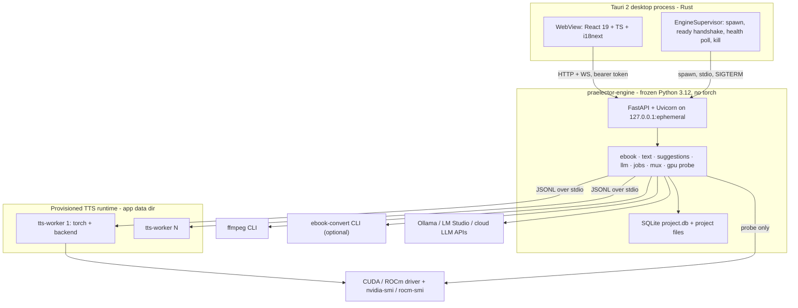
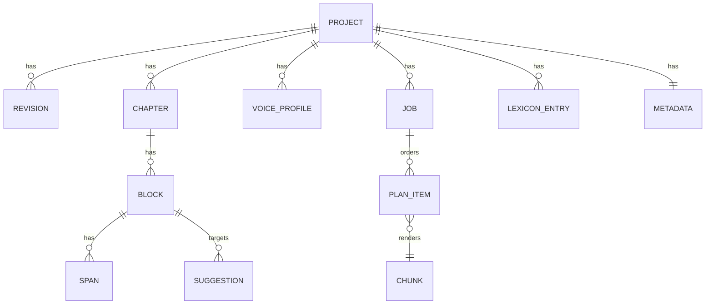
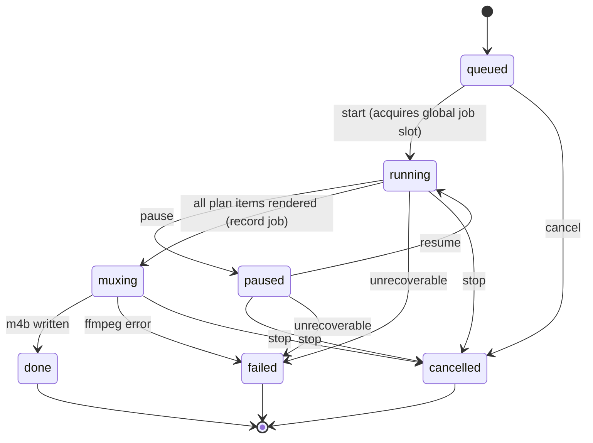

# Praelector — Implementation Plan (v1)

**Tagline:** _Prepare the page. Cast the voice._
**Scope:** v1 only, as defined by [PRD.md](../PRD.md). This plan implements the PRD; where the PRD is silent, the simplest option is chosen and recorded in [§3 Decisions](#3-decisions).
**Companion documents:** [REPO_LAYOUT.md](REPO_LAYOUT.md) · [DATA_MODEL.md](DATA_MODEL.md) · [OPENAPI_SKETCH.md](OPENAPI_SKETCH.md) · [CI_AND_RELEASE.md](CI_AND_RELEASE.md) · [SEQUENCES.md](SEQUENCES.md)

---

## 1. Architecture

### 1.1 Process topology



Three process tiers exist because they have three different dependency footprints:

- **Desktop shell (Rust)** — window, sidecar lifecycle, native dialogs, single instance. Ships in the installer.
- **Engine core (Python, frozen with PyInstaller onedir)** — everything that does not need `torch`: ebook I/O, span/suggestion model, LLM routing, job orchestration, GPU probing, ffmpeg muxing. Ships in the installer (~120 MB).
- **TTS runtime (Python venv created on the user's machine by a bundled `uv`)** — `torch` plus backend packages, either the `cuda` or the `rocm` flavour. Never in the installer (see [D-04](#d-04-two-tier-packaging-frozen-core--provisioned-tts-runtime)). Runs as short-lived **worker processes**, one per TTS parallel slot.

### 1.2 Why TTS runs in separate worker processes

1. VRAM is released deterministically when a worker exits, which is what makes GPU-05 admission control honest.
2. A CUDA/HIP OOM or driver fault kills one worker, not the app or the job (JB-03/JB-04).
3. It lets the engine core stay torch-free, so the installer does not need a 3 GB wheel and CI can test the whole job engine with a `fake` backend.
4. Worker count is the scheduler's only knob, so GPU-04 maps directly onto "number of live worker processes".

### 1.3 Module map (engine core)

| Package | Responsibility | Requirement IDs |
| --- | --- | --- |
| `praelector.api.v1` | FastAPI routers, request/response models, WS hub | NF-01, all UI-facing |
| `praelector.domain` | Ids, enums, Pydantic entities, hashing, revision logic | AI-04, AI-07, JB-05 |
| `praelector.store` | SQLite engine, migrations, repositories, project dir layout, atomic writes, locks | ED-07, JB-02, JB-07 |
| `praelector.ebook` | Format detect, DRM refusal, EPUB read/write, Calibre invocation, PDF text-layer probe, front-matter heuristics | EB-01…EB-09, EX-01…EX-03 |
| `praelector.text` | Normalisation, sentence segmentation, dialogue split, gender, Polish numerals, acronyms, artifacts, lexicon, pipeline orchestration, prompt templates | AI-02, AI-08, AI-09, DG-01…DG-06 |
| `praelector.llm` | Provider protocol, router, three clients, schema-validated calls, secret storage, usage counters | LM-01…LM-07, AI-03, AI-10 |
| `praelector.voices` | Sample ingest chain, voice profiles, preview render | TTS-04 |
| `praelector.audio` | ffmpeg wrapper, probe, WAV read/write, loudness, silence trim, concat | TTS-04, TTS-08, MX-04 |
| `praelector.tts` | Backend protocol, descriptor registry, worker client, model cache, license gate | TTS-01, TTS-02, TTS-05 |
| `praelector.gpu` | Device detection, budget math, VRAM monitor | GPU-01…GPU-08 |
| `praelector.jobs` | Job manager and state machine, prep job, record job, planner, chunker, scheduler, checkpointing, metrics, event log | AI-01, JB-01…JB-07, UI-01…UI-07 |
| `praelector.mux` | Chapter concat, ffmetadata, M4B assembly, partial mux | MX-01…MX-05 |
| `praelector.runtime` | TTS runtime provisioning via bundled `uv`, flavour selection, progress reporting | GPU-07, TTS-02 |

### 1.4 Module map (UI)

| Feature folder | Surface | Requirement IDs |
| --- | --- | --- |
| `features/library` | Home, recent projects, new/open project | PRD §5.1 |
| `features/ingest` | File pick, format detect, DRM error, Calibre missing dialog | EB-01…EB-04 |
| `features/chapters` | Chapter tree, rename/reorder/merge/split, include/exclude | ED-01 |
| `features/editor` | CodeMirror 6 chapter editor, span decorations, pronunciation pairs, find/replace, spoken-vs-print toggle | ED-02…ED-09 |
| `features/suggestions` | Review queue, filters, accept/reject/edit, bulk + undo, jump-to-span | AI-06, AI-08, AI-11, IX-03 |
| `features/voices` | Sample upload, waveform preview, per-slot assignment, backend params panel | TTS-03…TTS-06, TTS-09 |
| `features/job` | Start/pause/resume/stop, stage, fragment, counts, RTF, ETA, VRAM | UI-01…UI-07 |
| `features/metadata` | Metadata form, cover, M4B export, partial mux, EPUB export | MX-01…MX-05, EX-01…EX-03 |
| `features/settings` | LLM profiles, TTS backends and licenses, GPU policy, runtime provisioning, paths, language | LM-01…LM-06, GPU-06…GPU-08, IX-01 |

### 1.5 Transport and trust boundary

- Engine binds `127.0.0.1` with port `0` (OS-assigned) — NF-01.
- Tauri generates a 32-byte random token, passes it via the **environment** (`PRAELECTOR_TOKEN`), never argv, because argv is world-readable in process listings on both Windows and Linux.
- Every request requires `Authorization: Bearer <token>`; the WS handshake takes the same header. The engine additionally rejects requests whose `Origin` is present and not in `{tauri://localhost, http://localhost:1420}`. This blocks a web page in the user's browser from driving the engine ([D-10](#d-10-bearer-token--origin-check-on-the-loopback-api)).
- `tauri.conf.json` CSP allows `connect-src 'self' http://127.0.0.1:* ws://127.0.0.1:*` and nothing else.
- The engine never returns user-facing prose. It returns stable error codes (`ebook.drm_detected`, `tts.language_unsupported`) plus machine-readable detail; the UI localises them ([D-16](#d-16-engine-returns-error-codes-not-prose)) — IX-02.

### 1.6 Sidecar launch and supervision

Ready handshake:

1. Tauri resolves the engine command. Dev: `uv run --project engine praelector-engine`. Release: `<resourceDir>/engine/praelector-engine[.exe]`. Both overridable by `PRAELECTOR_ENGINE_CMD` for debugging.
2. Spawn with piped stdout/stderr and env `PRAELECTOR_TOKEN`, `PRAELECTOR_DATA_DIR`, `PRAELECTOR_LOG_LEVEL`, `PRAELECTOR_PARENT_PID`.
3. Engine binds the socket, then writes exactly one line to stdout:
   `PRAELECTOR_READY {"port":54321,"pid":12345,"version":"0.1.0","schema":1}`
4. Rust reads stdout lines for at most 30 s looking for that prefix; all other lines go to the rolling log buffer. On timeout it kills the child and shows a fatal panel with the last 200 lines and a "copy diagnostics" button.
5. `port` + token are stored in `tauri::State`; the UI obtains them once via the `engine_endpoint` command.

Supervision:

- `GET /v1/health` every 5 s; three consecutive failures ⇒ restart.
- Restart backoff 1 s, 2 s, 4 s, 8 s, 16 s. More than 5 restarts in 10 minutes ⇒ stop restarting, show the fatal panel.
- Shutdown: `POST /v1/shutdown` (engine pauses any running job, checkpoints, closes SQLite), wait up to 10 s, then SIGTERM/`TerminateProcess`, then SIGKILL after 5 s.
- Orphan prevention, per platform: on **Windows** the child is assigned to a Job Object with `JOB_OBJECT_LIMIT_KILL_ON_JOB_CLOSE`; on **Linux** the child gets its own process group and receives SIGTERM on exit. As a portable backstop, the engine polls `PRAELECTOR_PARENT_PID` every 5 s and exits if the parent is gone and no job is running.
- TTS workers are children of the engine and are torn down by the same logic, one level down.
- `tauri-plugin-single-instance` enforces one app instance, which is what makes "one project / one job at a time" (JB-06) enforceable. Belt and braces: the engine takes an exclusive lock on `<project_dir>/project.lock` containing its pid.

### 1.7 How a release build finds things

| Thing | Resolution order |
| --- | --- |
| Engine binary | `PRAELECTOR_ENGINE_CMD` → `<resourceDir>/engine/praelector-engine[.exe]` → dev `uv run` |
| Python for TTS | `<dataDir>/runtimes/<flavour>-<lockhash>/` created by the bundled `uv` + `python-build-standalone`; nothing is expected on the user's PATH |
| `uv` | `<resourceDir>/bin/uv[.exe]` (bundled, Apache-2.0/MIT) |
| ffmpeg / ffprobe | `settings.ffmpeg_path` → `PATH` → `<dataDir>/bin/ffmpeg[.exe]` (in-app guided fetch of an **LGPL** build) → error `audio.ffmpeg_missing` with per-OS instructions |
| `ebook-convert` | `settings.calibre_path` → `PATH` → error `ebook.calibre_missing` with per-OS instructions (EB-03) |
| Model weights | `settings.models_dir` → `<dataDir>/models/<backend>/<repo>/<revision>/`; `HF_HOME` is pointed here so workers never re-download |
| Projects | `settings.projects_dir` → `~/Praelector/projects/<project_id>/` (PRD §5.2) |

Platform paths:

| | Windows 11 | Linux |
| --- | --- | --- |
| Data (`dataDir`) | `%LOCALAPPDATA%\Praelector\` | `${XDG_DATA_HOME:-~/.local/share}/praelector/` |
| Config | `%APPDATA%\Praelector\config.json` | `${XDG_CONFIG_HOME:-~/.config}/praelector/config.json` |
| Logs | `%LOCALAPPDATA%\Praelector\logs\` | `${XDG_STATE_HOME:-~/.local/state}/praelector/logs/` |
| Path handling | all engine paths are `pathlib.Path`, serialised as POSIX-style strings with a drive prefix; long paths enabled in the NSIS installer manifest; no path may exceed 240 chars inside a project dir (chunk names are hashes, so this holds) | — |

---

## 2. Windows vs Linux differences

| Area | Windows 11 x64 | Linux x64 | Plan |
| --- | --- | --- | --- |
| NVIDIA torch | `torch==2.13.0` from `https://download.pytorch.org/whl/cu130` (cp312 `win_amd64` wheels published) | same index, manylinux wheels | one `cuda` extra, one lockfile per platform |
| AMD torch | PyTorch publishes **no** ROCm wheels for Windows. AMD's own index (`repo.radeon.com`, ROCm 7.2.x, torch 2.9.1, Python 3.12 only) is inference-focused and best-effort | `torch[device-gfx1200]==2.12.0+rocm7.14.0` from `https://repo.amd.com/rocm/whl-multi-arch/` — RX 9060 XT is **gfx1200** and officially listed | `rocm` extra is gated `sys_platform == "linux"`. Windows + AMD gets a modal: "ROCm on Windows is experimental; use the CPU flavour or Linux" ([D-20](#d-20-windows--amd-rocm-is-best-effort)) — GPU-07 |
| VRAM probe | `nvidia-smi.exe` (in `System32` via driver), `amd-smi.exe` if installed | `nvidia-smi`, `rocm-smi`, `amd-smi` | subprocess probe, optional `nvidia-ml-py` fast path — GPU-01 |
| ffmpeg | not present by default; guided fetch of an LGPL shared build into `<dataDir>/bin` | usually present (`pacman -S ffmpeg`); package manager suggested first | never bundled in the installer ([D-06](#d-06-ffmpeg-for-all-audio-io-not-bundled)) — MX-04 |
| Calibre | `ebook-convert.exe`, default `C:\Program Files\Calibre2\` added to the search hints | `ebook-convert` on PATH, `pacman -S calibre` hint | external process only — NF-04 |
| Installer | NSIS installer + portable ZIP | AppImage + `.tar.gz` | NF-11 |
| Code signing | unsigned in v1; SmartScreen warning documented in README; Azure Trusted Signing planned post-v1 | unsigned; `SHA256SUMS` published | [D-24](#d-24-unsigned-binaries-in-v1) |
| Long-running child processes | Job Object kill-on-close | process group + SIGTERM | §1.6 |
| Case sensitivity | EPUB internal hrefs are matched case-insensitively as a fallback with a warning | case-sensitive first | `ebook/epub_read.py` |
| glibc floor | n/a | AppImage built on `ubuntu-22.04` (glibc 2.35), covers CachyOS | CI matrix |

---

## 3. Decisions

Decisions taken because the PRD is silent, or because research contradicted a suggested stack choice.

### D-01 No EbookLib; hand-rolled EPUB reader/writer

**EbookLib is AGPL-3.0-or-later** (verified: PyPI metadata and `LICENSE.txt` in `aerkalov/ebooklib`). Importing it into an Apache-2.0 desktop application and distributing binaries would put the whole work under AGPL. It is therefore rejected despite being in the suggested stack.

Replacement: `ebook/epub_read.py` and `ebook/epub_write.py` built on `zipfile` (stdlib), `lxml` (BSD-3, libxml2 MIT) and `beautifulsoup4` (MIT) for tolerant XHTML. EPUB 2/3 reading is `META-INF/container.xml` → OPF (metadata, manifest, spine) → NCX or `nav.xhtml`; writing is a deterministic zip with `mimetype` stored first, uncompressed. Estimated 400–600 lines plus tests, and it gives exact control over the `data-prl-*` round-trip needed by EX-01.

### D-02 SQLite is the primary store

`<project>/project.db` (SQLite, WAL, SQLModel/SQLAlchemy 2.0 + Alembic) is authoritative for Project, Chapter, Block, Span, Suggestion, VoiceProfile, Job and the Chunk index — PRD §8 requires choosing one. Two exceptions exist for crash-safety reasons:

- `<project>/project.json` — a small manifest (schema version, id, name, created, voice mode, backend id) so the Library can list projects without opening databases.
- `jobs/<job_id>/job.json` + `audio/chunks/**/*.json` sidecars — **on-disk truth for resume**. On open, `store.reconcile_job()` rebuilds the DB chunk index from sidecars; disk wins on conflict. This is what makes JB-07 work after a power loss mid-transaction.

### D-03 `uv` with mutually exclusive `cuda` / `rocm` / `cpu` extras

`uv` is chosen over poetry because it can bind a package to a specific index *per extra* and declare extras mutually exclusive, which is exactly the torch problem. Verified against uv's PyTorch integration docs.

```toml
# engine-tts/pyproject.toml (abridged)
[project.optional-dependencies]
cpu  = ["torch==2.13.0"]
cuda = ["torch==2.13.0"]
rocm = ["torch==2.12.0", "pytorch-triton-rocm; sys_platform == 'linux'"]

[tool.uv]
conflicts = [[{ extra = "cpu" }, { extra = "cuda" }, { extra = "rocm" }]]

[tool.uv.sources]
torch = [
  { index = "pytorch-cpu",  extra = "cpu" },
  { index = "pytorch-cu130", extra = "cuda" },
  { index = "amd-rocm",      extra = "rocm", marker = "sys_platform == 'linux'" },
]

[[tool.uv.index]]
name = "pytorch-cpu"
url = "https://download.pytorch.org/whl/cpu"
explicit = true

[[tool.uv.index]]
name = "pytorch-cu130"
url = "https://download.pytorch.org/whl/cu130"
explicit = true

[[tool.uv.index]]
name = "amd-rocm"
url = "https://repo.amd.com/rocm/whl-multi-arch/"
explicit = true
```

Rules:

1. **One torch version per extra, never a union.** There is no fat wheel and no attempt to make one environment serve both vendors.
2. Three lockfiles are committed: `uv.lock` (core, no torch), `engine-tts/uv.lock`, and a `docs/gpu.md` table of the exact tested tuples per reference machine.
3. AMD is pinned to **torch 2.12.x + rocm7.14** rather than 2.13, because the 2.13 ROCm wheel has a known CPU-ISA detection regression outside ROCm container images. Re-evaluate at M6.
4. AMD device extras (`torch[device-gfx1200]`) are appended by the provisioner after detecting the gfx target, so a gfx1201 user is not forced onto gfx1200 kernels.
5. `--torch-backend=auto` is used only as a diagnostic aid; it is not part of the provisioning path because it is `uv pip`-only and we want reproducible locked installs.
6. The engine core's own lockfile must never resolve `torch`. CI asserts this.

### D-04 Two-tier packaging: frozen core + provisioned TTS runtime

PRD §8 requires that "production must not require the user to hand-assemble Python". It does not require a single binary. Since CUDA torch and ROCm torch cannot coexist and either adds 2.5–4 GB, the installer ships the torch-free core and the app provisions the GPU runtime on first use:

1. Settings → Recording runtime shows detected hardware and the recommended flavour (`cuda` / `rocm` / `cpu`).
2. On confirm, the engine runs bundled `uv` with the committed `engine-tts/uv.lock` into `<dataDir>/runtimes/<flavour>-<lockhash>/`, streaming progress over WS (`runtime.progress`), and shows the download size and the licenses involved.
3. `runtime.json` records flavour, torch version, lock hash, Python version and the gfx/compute capability it was built for. A flavour/hardware mismatch is detected and explained (GPU-07).
4. The user never sees a shell. Failures are reported with the `uv` log tail and a documented manual fallback in `docs/packaging.md`.

Engine core is frozen with **PyInstaller onedir** (not onefile: onefile re-extracts on every launch, which is slow and a reliable way to trip Windows AV heuristics). PyInstaller is GPL-2.0-with-bootloader-exception, build-tool-only, and the exception explicitly permits shipping non-GPL frozen applications; recorded in `docs/licenses.md`.

### D-05 TTS backends run in worker processes over JSONL stdio

Rationale in §1.2. Protocol in §6. Audio is written to disk by the worker; only paths and metrics cross the pipe, so no large payload serialisation and identical behaviour on Windows and Linux (no `fork`, no shared memory, no local sockets to firewall).

### D-06 ffmpeg for all audio I/O; not bundled

Dropped from the suggested stack: `soundfile` (its wheel embeds **LGPL-2.1** libsndfile), `pyloudnorm` (pulls `scipy`), `pydub` (unmaintained, needs the removed `audioop`), `ffmpeg-python` (unmaintained). Instead:

- decode of user samples (WAV/FLAC/MP3/M4A/OGG) → ffmpeg to PCM16 WAV — TTS-04
- loudness normalisation → ffmpeg two-pass `loudnorm` (target LUFS configurable) — TTS-04
- silence trim → ffmpeg `silenceremove` (energy-based; documented as such, see [D-21](#d-21-omnivoice-is-always-called-with-ref_text)) — TTS-04
- in-process PCM → `numpy` + stdlib `wave`; chunk concat and inter-sentence silence are built in Python and handed to ffmpeg's concat demuxer — TTS-08
- M4B encode → ffmpeg native `aac` encoder (available in LGPL builds; no libfdk needed) — MX-01
- ffmpeg is invoked via a hand-written argument builder in `audio/ffmpeg.py` so the arg lists are unit-testable

Not bundling ffmpeg avoids shipping a GPL binary inside an Apache-2.0 installer and matches MX-04 ("depend on a system or bundled ffmpeg; document the dependency"). Required: ffmpeg ≥ 6.0 with `aac`, `loudnorm`, `silenceremove`; probed once and cached.

### D-07 Chunk audio is content-addressed at project level

PRD §5.2 puts chunks under `jobs/<job_id>/chunks/<nnnnn>.wav` but says the on-disk schema is an implementation choice. Positional filenames break reuse as soon as a chapter is reordered or a paragraph is inserted. v1 stores audio at `<project>/audio/chunks/<rk[0:2]>/<render_key>.wav` with a JSON sidecar of the same stem, and `jobs/<job_id>/plan.jsonl` holds the ordered plan (ordinal → render_key → text prefix). Consequences: reordering chapters re-renders nothing; re-running a job after edits reuses every untouched chunk; the cache survives "reset job" unless the user confirms deletion (JB-04).

### D-08 Block is a first-class entity; span offsets are block-scoped

A chapter is an ordered list of **blocks** (paragraph / heading / blockquote / list-item), each with `text` and a `source_ref` back to the XHTML element. Spans carry `(block_id, start, end)`. Global chapter offsets would be invalidated by every edit and would make EPUB export guesswork. Chapter plain text for ED-02 is blocks joined with `\n\n`; committing re-splits on blank lines and re-associates block identities by similarity so span data survives typo fixes. Blocks and spans are versioned (SCD-2, see [DATA_MODEL.md](DATA_MODEL.md)) which is what gives AI-07 "a new book revision" and AI-06 undo.

### D-09 CodeMirror 6 for the lector editor

Plain text plus range decorations is exactly our model. ProseMirror/TipTap would impose a rich-document model we explicitly do not want (ED-10 is out of scope). CodeMirror 6 is MIT, tree-shakeable, and its `Decoration` API maps 1:1 onto span highlighting (ED-03) and suggestion anchors (ED-08).

### D-10 Bearer token + Origin check on the loopback API

NF-01 only requires binding `127.0.0.1`, which still leaves the engine reachable by any local process or any web page the user visits. A per-launch token in the environment plus an Origin allow-list is the cheapest fix. See §1.5.

### D-11 Own Polish numeral module instead of `num2words`

`num2words` is LGPL-2.1, and we need forms it does not do well anyway: `Rozdział 8` → `Rozdział ósmy` (ordinal, masculine, nominative), `1939` → `tysiąc dziewięćset trzydziesty dziewiąty` (year), `18:00` → `osiemnastej`, `3,5` → `trzy i pięć dziesiątych`, `XIV` → `czternaste`. `text/numerals_pl.py` implements cardinal nominative, ordinal masculine/feminine/neuter nominative, years, decimals with a comma separator, and Roman numerals, backed by a golden table test.

### D-12 `dict_hit` uses an English wordlist plus orthographic signals; no Polish dictionary in v1

A Polish wordlist would be needed to suppress false positives, and the good ones (PoliMorf, SJP) need license review that is not worth blocking v1 on. v1 flags a token when it is in a vendored public-domain English list **and** carries English-only orthography (`th`, `wh`, `qu`, `ck`, `oo`, `ee`, `-ing`, `-tion`, `-ness`, no Polish diacritics) **and** is not in the user lexicon. The LLM confirms borderline cases (AI-03), and AI-09's user lexicon absorbs the long tail. Adding a licensed Polish dictionary is a post-v1 task.

### D-13 Single GPU device per job

PRD is silent on multi-GPU. Settings expose `device_index`; workers get `CUDA_VISIBLE_DEVICES` / `HIP_VISIBLE_DEVICES` pinned to it. No sharding, no multi-device scheduling.

### D-14 One active job of any kind per app instance

JB-06 only constrains recording jobs, but allowing a prep job to run alongside one complicates the UI and the LLM/GPU budget for no v1 benefit. `JobManager` holds a single global slot; starting a second job returns `job.already_active`.

### D-15 `Suggestion.status` includes `failed`

AI-03 requires recording a failed LLM suggestion; AI-04's enum lists only review statuses. v1 uses `pending | accepted | rejected | edited | failed`, where `failed` rows carry `error_code` and `proposed = null`, are excluded from apply, and are filterable in review.

### D-16 Engine returns error codes, not prose

Every error is `{"error": {"code": "ebook.drm_detected", "detail": {...}, "retryable": false}}`. All user-facing text lives in `apps/ui/src/i18n/locales/**`, which is what makes IX-01/IX-02 mechanically checkable.

### D-17 Qwen3-TTS ships but cannot narrate Polish

Verified: Qwen3-TTS (Apache-2.0, open weights 0.6B/1.7B, Base/CustomVoice/VoiceDesign + a separate 12 Hz tokenizer) supports **zh, en, ja, ko, de, fr, ru, pt, es, it** — Polish is not among them. TTS-02 still requires the adapter, so it ships with `languages` excluding `pl`, and `POST /v1/jobs` refuses to start with `tts.language_unsupported` when the project language is outside the backend's list. This is the language-list capability flag from TTS-01 doing its job. For Polish books the real choices are OmniVoice (default) and Chatterbox.

### D-18 `pysbd` for sentence segmentation

MIT, rule-based, no model download, and it has a Polish rule set (`pysbd.Segmenter(language="pl")`). Wrapped behind a `SentenceSegmenter` protocol with a Polish abbreviation guard list (`np.`, `tzn.`, `itd.`, `itp.`, `m.in.`, `ok.`, `godz.`, `ul.`, `dr.`, `prof.`, `r.`, `w.`, `św.`) and a regex fallback, so it can be swapped without touching the chunker. spaCy is rejected (model download, size).

### D-19 No browser e2e tests in v1

Vitest for UI logic, pytest for engine, one integration test that drives a full job through the API with the `fake` backend. Playwright is post-v1 (NF-08 asks for unit tests of heuristics and resume logic, which this covers).

### D-20 Windows + AMD ROCm is best-effort

See §2. The `rocm` extra is Linux-only. Windows AMD users are offered the `cpu` flavour with the GPU-08 slow-path modal, and `docs/gpu.md` documents AMD's Windows wheel index as an unsupported manual path.

### D-21 OmniVoice is always called with `ref_text`

OmniVoice auto-transcribes the reference clip with Whisper when `ref_text` is omitted, which would silently pull a second model. The voice profile therefore stores a required `ref_text` (the user types or pastes what the sample says; the Voices UI makes this a required field). OmniVoice's voice-design mode is trained on zh/en only and is not exposed for Polish projects.

### D-22 Chatterbox output watermarking is disclosed

Chatterbox embeds a PerTh watermark in every generated clip. That is a property of the audiobook the user produces, so the backend descriptor sets `capabilities.watermark = true` and the Voices/Backends screen states it before a job starts.

### D-23 macOS is CI-only

`macos-14` job runs with `continue-on-error: true` and produces no release artifact. Not advertised anywhere in the UI.

### D-24 Unsigned binaries in v1

No certificate is available. README documents the SmartScreen/Gatekeeper consequences and publishes `SHA256SUMS`. Signing is an explicit post-v1 item.

### D-25 OmniVoice licensing is better than the PRD assumed

Verified: `k2-fsa/OmniVoice` is Apache-2.0 for code **and** the 0.6B weights (the audio tokenizer, Higgs Audio v2, is also Apache-2.0). The PRD's "weights often CC-BY-NC" risk does not apply to the default checkpoint. The license-gate machinery (TTS-02, NF-03) is still built, because descriptors carry per-asset SPDX data and a non-commercial checkpoint may appear later; it simply shows "Apache-2.0, no acknowledgement required" for the default.

---

## 4. Data model summary

Full schema, DDL and JSON shapes are in [DATA_MODEL.md](DATA_MODEL.md). Shape at a glance:



Key invariants:

- `Span.(block_id, start, end)` is always inside `Block.text`; enforced on write.
- `Block` and `Span` are SCD-2 versioned by `valid_from_revision` / `valid_to_revision`.
- `Chunk` is keyed by `render_key` and is immutable once written.
- `PlanItem` maps `(job_id, ordinal) → render_key`, so plan order and audio identity are independent (D-07).
- `GpuBudget` is a computed snapshot, persisted per job start and per admission change for auditability (GPU-02/GPU-06).

---

## 5. Text pipeline: dialogue, gender, suggestions

### 5.1 Deterministic pre-pass (AI-02)

Runs before any LLM call, in order, per block:

1. **Normalise** — NFC, collapse runs of whitespace (recorded as `conversion_artifact`), strip soft hyphens `U+00AD`, join `word-\nword` hyphenation, unify dash characters into a canonical map while remembering the original.
2. **Skip candidates** (EB-08) — ISBN pattern, `Copyright` / `Wszelkie prawa zastrzeżone` / `All rights reserved`, `Tytuł oryginału`, `Redakcja|Korekta|Skład|Projekt okładki`, bare page numbers, `Spis treści` plus a run of ≥5 short blocks matching chapter titles.
3. **Dialogue segmentation** (DG-01/DG-02) — §5.2.
4. **Speaker gender** (DG-03/DG-04) — §5.3.
5. **Numerals / ordinals** — digits, ordinals, times, years, Roman numerals → `numeral` / `ordinal_heading` via `numerals_pl.py`.
6. **Acronyms** — 2–5 uppercase letters not in a known-word list → `acronym` with a spelled-out Polish readout (`IT` → `aj ti`).
7. **Foreign tokens** — D-12 signals → `foreign_word`; a curated toponym gazetteer (hand-written, ~300 entries: `Washington DC`, `Nowy Jork`, `Los Angeles`, …) → `toponym`.
8. **Lexicon** (AI-09) — global then project lexicon applied as exact/regex rules; matches become `dict_hit` suggestions, pre-accepted if the entry is marked `auto`.

Every producer emits `Suggestion` rows with `detector = heuristic | dict` and a confidence. Nothing mutates a block (product principle 1).

### 5.2 Dialogue split algorithm (DG-01, DG-02 — v1 blockers)

Recognised openers: `—` (U+2014), `–` (U+2013), `-` (U+002D) followed by whitespace; Polish quotes `„…”`, `«…»`, `”…”`, `"…"`.

```
segment_block(text) -> [Segment(kind=narration|dialogue, start, end, confidence)]

1. Split candidates:
   a) paragraph-initial dash            -> boundary, seed state = DIALOGUE
   b) whitespace-flanked dash " — "     -> candidate boundary
   c) ":" + whitespace + dash           -> boundary, next = DIALOGUE
   d) balanced quote pair               -> candidate DIALOGUE region
   otherwise seed state = NARRATION
2. Walk candidates left to right, alternating state on each confirmed boundary.
3. Confirm a (b) boundary only if the following segment starts, within its first
   three tokens, with a verb of saying (SPEECH_VERBS, inflected) optionally
   preceded by a pronoun or capitalised name.
   - confirmed  -> boundary, next = NARRATION, confidence 0.90
   - a dash that closes such a narration insertion -> next = DIALOGUE, 0.90
   - not confirmed -> NOT a boundary; the dash is an aside/pause. Emit a
     dialogue_split suggestion at confidence 0.45 for human review.
4. Quote regions without a speech verb in the same or adjacent sentence stay
   narration and yield a 0.40 suggestion (a quoted note is not speech).
5. Unbalanced quotes or an odd dash count -> 0.35 suggestion, never applied.
```

`SPEECH_VERBS` is a curated inflected list in `text/data/speech_verbs_pl.txt`: `powiedział(a)`, `rzekł(a)`, `mówił(a)`, `odparł(a)`, `odrzekł(a)`, `odpowiedział(a)`, `zapytał(a)`, `spytał(a)`, `krzyknął/krzyknęła`, `szepnął/szepnęła`, `mruknął/mruknęła`, `warknął/warknęła`, `dodał(a)`, `wtrącił(a)`, `ciągnął/ciągnęła`, `zauważył(a)`, `stwierdził(a)`, `westchnął/westchnęła`, `syknął/syknęła`, `jęknął/jęknęła`, `zaczął/zaczęła`, `skończył(a)`, `przerwał(a)`.

**Auto-apply threshold:** `dialogue_split` suggestions apply automatically only at confidence ≥ 0.75 and only when the job runs with "apply high-confidence structure" enabled; every split remains listed and reversible. Anything below the threshold is review-only (PRD risk table: "never auto-apply low-confidence splits").

The LLM is consulted (task `dialogue_hard`) only for blocks where step 3 or 4 produced a sub-threshold candidate, with context = target block ± 1 block, capped at 1200 characters per side (AI-03).

### 5.3 Speaker gender (DG-03, DG-04, DG-05)

Signals, highest precision first:

| Rank | Signal | Confidence | Notes |
| --- | --- | --- | --- |
| 1 | Past-tense gender suffix of a speech verb in the attached narration: `-ł` → male, `-ła` → female (`powiedział` / `powiedziała`, `mruknął` / `mruknęła`) | 0.95 | Polish morphology makes this near-deterministic |
| 2 | Explicit given name in the speech tag, resolved through `text/data/given_names_pl.tsv` (+ common English names) | 0.85 | Exception list is mandatory: `Barnaba`, `Kuba`, `Bonawentura`, `Kosma`, `Jarema` are male despite `-a` |
| 3 | Adjacent-sentence pronouns and gendered participles (`ona`, `zrobiła`, `sam`, `sama`) | 0.65 | window = same block ± 1 block |
| 4 | Chapter-scoped speaker map: once a `speaker_id` is resolved by name, propagate its gender to other dialogue spans tagged with the same `speaker_id` | 0.60 | DG-06 gives `speaker_id` as a UI label; reusing it for gender stays within DG-04's "local context" |
| 5 | LLM (task `dialogue_hard`) when signals disagree or max confidence < 0.70 | reported by model, capped at 0.80 | DG-04 mandates this |

Fallback when gender stays `unknown` (DG-05), by voice mode: `single` → narrator; `narrator_dialogue` → dialogue voice; `narrator_male_female` → narrator, flagged. In all cases a `speaker_gender` suggestion is created so it appears in review.

### 5.4 Suggestion categories

Exactly the nine from PRD §6.3.1: `foreign_word`, `acronym`, `toponym`, `numeral`, `ordinal_heading`, `dialogue_split`, `speaker_gender`, `conversion_artifact`, `dict_hit`. No others.

### 5.5 LLM routing (LM-04)

| Task key | Used for | Default profile | Batching |
| --- | --- | --- | --- |
| `classify_cheap` | confirm acronym / foreign / toponym / numeral readouts | local 7–14B or Groq/Gemini Flash | up to 8 items per request |
| `dialogue_hard` | sub-threshold dialogue splits, contested gender | strongest configured profile | 1 block per request |
| `pronounce` | produce a Polish readout for a confirmed foreign token | `classify_cheap` profile | up to 8 items |

Structured output: JSON Schema response format when the profile advertises it, else `json_object`, else prompt-only. Invalid JSON ⇒ one retry with the validation error appended ⇒ then a `failed` suggestion (AI-03, D-15). Cloud profiles require the per-project cloud toggle (LM-05, NF-02); if no cloud profile is enabled and a local one exists, local is used without asking. On 429/5xx the router offers the local profile (AI-10).

---

## 6. TTS plugin protocol (TTS-01, TTS-05)

Frozen at the end of M3, before backends 2 and 3 are written (PRD risk table).

### 6.1 Python-side Protocol (runs inside the worker)

```python
class TtsBackend(Protocol):
    id: ClassVar[str]                 # "omnivoice" | "chatterbox" | "qwen3_tts" | "fake"
    adapter_version: ClassVar[str]    # semver of THIS adapter; part of render_key

    @staticmethod
    def describe() -> BackendDescriptor: ...
    def load(self, ctx: LoadContext) -> LoadReport: ...
    def synthesize(self, req: SynthesisRequest) -> SynthesisResult: ...
    def probe_vram(self) -> VramReport: ...
    def unload(self) -> None: ...
```

`BackendDescriptor` (a Pydantic model, exported to the UI verbatim):

```jsonc
{
  "id": "omnivoice",
  "display_name": "OmniVoice",
  "adapter_version": "1.0.0",
  "model": { "repo": "k2-fsa/OmniVoice", "revision": "<pinned sha>", "params": "0.6B" },
  "capabilities": {
    "clone": true,
    "voice_design": false,            // trained on zh/en only -> not exposed (D-21)
    "emotion": false,
    "languages": ["pl", "en", "de", "..."],   // gate for TTS-01 / D-17
    "streaming": false,
    "batching": false,
    "deterministic_with_seed": true,
    "watermark": false,               // true for chatterbox (D-22)
    "native_sample_rate": 24000,
    "max_input_chars": 400,
    "reference_audio": {
      "required": true, "min_seconds": 3, "max_seconds": 20,
      "needs_ref_text": true, "target_sample_rate": 24000
    }
  },
  "params_schema": { "$schema": "…2020-12", "type": "object", "properties": { /* … */ } },
  "vram_profile": { "fp16": { "peak_mib": 3500, "measured": false } },
  "licenses": [
    { "component": "code",      "spdx": "Apache-2.0", "url": "…", "acknowledgement_required": false, "commercial_use": true },
    { "component": "weights",   "spdx": "Apache-2.0", "url": "…", "acknowledgement_required": false, "commercial_use": true },
    { "component": "tokenizer", "spdx": "Apache-2.0", "url": "…", "acknowledgement_required": false, "commercial_use": true }
  ],
  "assets": [
    { "name": "model", "uri": "hf://k2-fsa/OmniVoice@<sha>", "allow": ["*.safetensors","*.json"], "sha256": "…", "size_bytes": 1234567, "target": "omnivoice/<sha>/" }
  ]
}
```

`params_schema` properties carry `x-prl-ui` hints (`widget`, `group`, `order`, `step`, `advanced`) so the Voices screen renders per-backend panels with zero backend-specific UI code (TTS-05).

### 6.2 Worker wire protocol (D-05)

Newline-delimited JSON on stdin/stdout. One request in flight per worker.

| Direction | Message |
| --- | --- |
| → worker | `{"id":1,"op":"describe"}` |
| → worker | `{"id":2,"op":"load","params":{"device":"cuda:0","precision":"fp16","models_dir":"…","backend_params":{…}}}` |
| → worker | `{"id":3,"op":"synthesize","text":"…","language":"pl","voice":{"profile_id":"…","ref_audio":"…","ref_text":"…"},"params":{…},"seed":1234,"out_path":"…/<render_key>.wav"}` |
| → worker | `{"id":4,"op":"probe_vram"}` / `{"op":"unload"}` / `{"op":"shutdown"}` |
| ← worker | `{"id":3,"ok":true,"result":{"duration_s":4.12,"sample_rate":24000,"peak_vram_mib":3380,"infer_ms":1180,"rtf":0.29,"model_revision":"…","watermarked":false}}` |
| ← worker | `{"id":3,"ok":false,"error":{"code":"tts.oom","message":"…","retryable":true}}` |
| ← worker | `{"event":"ready","pid":4242,"device":"cuda:0","torch":"2.13.0+cu130"}` / `{"event":"log",…}` / `{"event":"progress",…}` |

The worker writes `<out_path>.part`; the engine validates duration/size and performs the atomic rename plus sidecar write (JB-02). Error codes: `tts.oom`, `tts.model_missing`, `tts.load_failed`, `tts.input_too_long`, `tts.language_unsupported`, `tts.internal`.

### 6.3 Voice slots and fallback

| Voice mode | Slots | Span → slot | Missing sample (TTS-06) |
| --- | --- | --- | --- |
| `single` | `narrator` | everything → narrator | error before start: narrator is mandatory |
| `narrator_dialogue` | `narrator`, `dialogue` | dialogue spans → `dialogue`, else narrator | warn, fall back to narrator |
| `narrator_male_female` | `narrator`, `male`, `female` | dialogue+male → `male`, dialogue+female → `female`, dialogue+unknown → narrator, else narrator | warn per slot, fall back to narrator; the job still runs |

Fallbacks are recorded in `job.json` `warnings[]` and shown in the job UI before the first chunk.

### 6.4 Voice sample ingest chain (TTS-04)

`upload → ffmpeg decode to PCM16 mono → silenceremove trim → two-pass loudnorm to target LUFS → resample to backend native rate → clamp to [min,max] seconds → write voices/<id>.wav + waveform peaks JSON + profile row`. Each step is a pure function over paths so it is testable; the whole chain re-runs when the backend changes native rate, which bumps `VoiceProfile.content_hash` and therefore invalidates affected chunks.

---

## 7. GPU budget and admission control

### 7.1 Detection (GPU-01, GPU-02)

`gpu/detect.py` shells out, parses, caches for 5 s:

- NVIDIA: `nvidia-smi --query-gpu=index,name,memory.total,memory.free,driver_version --format=csv,noheader,nounits`
- AMD: `amd-smi metric --mem --json` first, fall back to `rocm-smi --showmeminfo vram --json`, fall back to `/sys/class/drm/card*/device/mem_info_vram_{total,used}`
- CPU always present as a device with `vram = None`
- Optional fast path: `nvidia-ml-py` (BSD-3) for the 1 Hz in-job sampler, to avoid spawning a process every second
- A missing vendor stack is reported as `{"vendor":"amd","available":false,"reason":"rocm_smi_missing"}` so the UI can explain it (GPU-07)

### 7.2 Budget math — exactly GPU-04

```
total_mib        = device.memory_total
free_mib         = device.memory_free            # sampled immediately before admission
reserve_mib      = user_override or max(ceil(0.20 * total_mib), 1536)
peak_worker_mib  = user_override or vram_profile[backend][precision].peak_mib
max_workers      = max(1, floor((free_mib - reserve_mib) / peak_worker_mib))
effective        = min(max_workers, settings.worker_cap, backend.max_parallel)   # all >= 1
```

The formula is unchanged. Two annotations:

1. `max(1, …)` can return 1 on a card that cannot actually hold one worker (an 8 GB card with a 7 GB backend). v1 keeps the formula and handles the consequence: the job starts with 1 worker, shows a low-VRAM warning, sets `PYTORCH_CUDA_ALLOC_CONF=expandable_segments:True` (`PYTORCH_HIP_ALLOC_CONF` on ROCm), and on `tts.oom` retries the chunk once at lower precision before failing it with an actionable error.
2. `effective` only ever clamps downward and never below 1, so GPU-04's guarantee holds.

Worked examples with OmniVoice fp16 (`peak_worker_mib = 3500`, conservative default):

| GPU | total | free at start | reserve | max_workers |
| --- | --- | --- | --- | --- |
| RTX 4070 Ti | 12288 | 11000 | 2458 | `floor(8542/3500)` = **2** |
| RX 9060 XT | 16384 | 15000 | 3277 | `floor(11723/3500)` = **3** |
| 8 GB card | 8192 | 7200 | 1639 | `floor(5561/3500)` = **1** |
| CPU | — | — | — | 1, with the GPU-08 modal |

### 7.3 Admission control (GPU-05)

- A semaphore of size `effective` guards worker spawn.
- Before each spawn: re-sample free VRAM; admit only if `free_now - reserve >= peak_worker`. Otherwise wait and re-check on the next 1 s tick.
- If `free_now < reserve` (someone else grabbed memory, e.g. a game launched), set admissions to 0, emit `gpu.admissions_paused`, and let running workers finish. Resume when headroom returns for 3 consecutive samples.
- After a chunk completes, the measured `peak_vram_mib` updates the per-backend table (`measured: true`), which makes the second job on a machine better calibrated than the first (GPU-03).
- `GpuBudget` snapshots are persisted on every recompute for the job UI and for bug reports (GPU-06).

---

## 8. Job engine

### 8.1 State machine (JB-01)



States are exactly the PRD set. A separate informational `stage ∈ {plan, synth, mux}` drives UI-01 without inventing states. `kind ∈ {prep, record}`; a `prep` job never enters `muxing`.

Guards and effects:

| Transition | Guard | Effect |
| --- | --- | --- |
| `queued → running` | global job slot free (D-14); voices resolved; backend language supports project language (D-17); runtime provisioned; ffmpeg present | build plan, write `plan.jsonl`, compute `GpuBudget`, open admission semaphore |
| `running → paused` | — | stop admitting; in-flight chunks may finish (default) or be discarded per `settings.pause_mode`; `.part` files deleted; `job.json` written atomically (JB-03) |
| `running → muxing` | every non-skipped plan item has a chunk | concat per chapter, build ffmetadata, encode |
| `* → cancelled` | — | keep all finished chunks; never delete audio without an explicit `reset` with `delete_audio: true` (JB-04) |
| engine start, state ∈ `{running, muxing}` | — | force `paused` with `paused_reason = "crash_recovery"` (JB-07) |

Every transition appends to `jobs/<id>/events.jsonl` with a monotonic `seq` and then rewrites `job.json` via temp+rename. The WS stream carries the same `seq`, so a reconnecting UI calls `GET /v1/jobs/{id}/events?since=<seq>` and misses nothing.

### 8.2 Planner and chunker (TTS-07)

1. Take the current revision's included chapters in order.
2. For each chapter, walk blocks; drop `skip` spans; expand `pronunciation` spans to their spoken form; turn `pause` spans into silence directives (no TTS call, cheap).
3. Segment each narration/dialogue run into sentences with `pysbd` + the abbreviation guard (D-18).
4. Greedy-pack sentences into chunks up to `capabilities.max_input_chars`, never crossing a span-type or voice-slot boundary. A dialogue span shorter than the limit is emitted as exactly one chunk (TTS-07 "atomic when short enough").
5. Oversized single sentences split at clause punctuation (`;`, `,`, ` — `) and only then at the last whitespace before the limit. Never inside a word; asserted by a unit test over adversarial input.
6. Emit `PlanItem(ordinal, chapter_id, voice_slot, spoken_text, render_key, kind=tts|silence)`.

### 8.3 Chunk identity and invalidation (JB-02, JB-05)

```
text_hash   = blake2s(NFC(spoken_text).strip(), digest_size=16)
params_hash = blake2s(canonical_json(audio_affecting_params))     # seed included only if set
render_key  = blake2s(b"prl1|" + text_hash + voice_slot + voice_profile_id
                      + voice_profile_content_hash + backend_id + adapter_version
                      + model_revision + params_hash + chunker_version
                      + audio_format_version, digest_size=16).hex()
```

A chunk is reused iff a sidecar with that `render_key` exists, its WAV exists, and the WAV's size and duration match the sidecar. PRD's minimum (text hash + voice slot) is a subset; the extra fields prevent silently splicing audio rendered with a different voice, model or parameter set — which would be a worse failure than re-rendering.

| Change | Invalidates |
| --- | --- |
| Edit a block's spoken text | only chunks whose `text_hash` changed |
| Accept a pronunciation suggestion | only chunks containing that span |
| Re-ingest / re-normalise a voice sample | all chunks using that slot |
| Change backend, model revision, adapter version or an audio-affecting param | all chunks |
| Reorder chapters, rename a chapter, exclude a chapter | nothing (plan order only, D-07) |
| Change output sample rate / inter-sentence silence | nothing (applied at concat time) |

### 8.4 Progress metrics (UI-04, UI-05)

```
rtf_instant   = chunk.duration_s / chunk.wall_s                        # per chunk
throughput    = EMA(alpha=0.2) over sum(duration_s) / sum(wall_s)      # across workers
chars_per_sec = EMA over sum(chars) / sum(duration_s)                  # default seed 14.0 for Polish
eta_seconds   = (remaining_chars / chars_per_sec) / throughput
```

`job.progress` is emitted at most 4 Hz; `gpu.sample` at 1 Hz. The UI shows instantaneous and smoothed RTF, finished/remaining chunk and chapter counts, current chapter title + chunk ordinal + a 60-char text prefix (UI-02), VRAM used vs budget and live worker count (UI-06). Pause/resume/stop are rendered in a fixed toolbar that is never scrolled out (UI-07).

---

## 9. Milestones

Each task lists the requirement IDs it satisfies. File paths are given where they are already decided.

### M0 — Skeleton (week 1–2)

- [x] `chore`: monorepo scaffold per [REPO_LAYOUT.md](REPO_LAYOUT.md); `pnpm-workspace.yaml`, `justfile`, `.editorconfig`, `.gitignore` — PRD §8
- [x] `chore`: `LICENSE` (Apache-2.0), `NOTICE`, `CONTRIBUTING.md`, `CODE_OF_CONDUCT.md`, `SECURITY.md`, issue/PR templates, `CODEOWNERS` — PRD §9
- [x] `chore`: CI workflows `ci-engine`, `ci-ui`, `ci-desktop`, `licenses`, `pr-title`, `release-please`, `release` — NF-09, PRD §9
- [x] `feat(engine)`: `uv` project, Python 3.12 pin, `pyproject.toml` with `dev` group; `praelector.app` FastAPI factory; `GET /v1/health`, `GET /v1/version`; bearer-token middleware + Origin check; structured error model; JSON logging with a secret-redaction filter — NF-01, LM-03, D-10, D-16
- [x] `feat(engine)`: `engine-tts` package skeleton with `cpu`/`cuda`/`rocm` conflicting extras and committed locks; `fake` backend; CI asserts core lock contains no `torch` — GPU-07, D-03
- [x] `feat(desktop)`: Tauri 2 app, `EngineSupervisor` (spawn, ready handshake, health poll, backoff, kill, Job Object / process group), `engine_endpoint` command, single-instance plugin, fatal-engine panel — PRD §8, §1.6
- [x] `feat(ui)`: Vite + React 19 + TS + Tailwind, shadcn-style primitives, router, TanStack Query API client, WS client with `seq` gap-fill, i18next with `en` + `pl` catalogues and the parity check — IX-01, IX-02, IX-04
- [x] `feat(engine)`: settings store (`config.json` + keyring), `GET/PUT /v1/settings`, paths resolution, ffmpeg/Calibre probes — MX-04, EB-03
- [x] `feat`: project create/open/close; `project.json` manifest + `project.db` with Alembic baseline; `project.lock`; Library screen — ED-07, D-02
- [x] `chore`: `scripts/gen_ts_types.py` (Pydantic → JSON Schema → TS) + staleness check in CI — PRD §8
- [x] `docs`: `dev-setup.md`, `architecture.md` stub, `README.md` with the tagline and platform table

**Exit:** `just dev` opens the window; the UI shows engine version and GPU list; a project can be created and reopened; CI is green on Windows and Linux.

### M1 — Ebook core

- [ ] `feat(engine)`: format detection by magic bytes + extension — EB-01
- [ ] `feat(engine)`: DRM refusal — inspect `META-INF/encryption.xml`; reject when encrypted items include OPF/XHTML or the algorithm is not one of the two font-obfuscation URIs; reject on `META-INF/sinf.xml` / `rights.xml`; **do not** reject legitimate font obfuscation — EB-01, EB-02
- [ ] `feat(engine)`: fail-closed empty-text check (spine > 3 items but < 200 extractable chars) — EB-02
- [ ] `feat(engine)`: `ebook/epub_read.py` — container → OPF → manifest/spine → NCX/nav; metadata, authors, language, cover, TOC — EB-01, EB-05
- [ ] `feat(engine)`: `ebook/blocks.py` — XHTML → ordered blocks with `source_ref`; decorative-image drop; cover retained — EB-07, D-08
- [ ] `feat(engine)`: `ebook/epub_write.py` — deterministic EPUB 3 writer (mimetype first, uncompressed) → `source/working.epub`, original never mutated — EB-06
- [ ] `feat(engine)`: `ebook/calibre.py` — locate `ebook-convert`, run PDF/MOBI/AZW3 → EPUB in a temp dir, surface stderr, structured `ebook.calibre_missing` error with per-OS instructions — EB-03, EB-09, NF-04
- [ ] `feat(engine)`: `ebook/pdf.py` — `pypdf` text-layer probe; < 200 chars in the first 5 pages ⇒ `ebook.no_text_layer` ("no OCR in v1") — EB-04
- [ ] `feat(engine)`: `ebook/frontmatter.py` — skip-span heuristics — EB-08
- [ ] `feat(engine)`: chapter tree from spine + TOC; ops rename / reorder / merge / split-at-offset / include-exclude — ED-01
- [ ] `feat(engine)`: chapter plain-text get/put with block re-association by similarity; autosave; find/replace with dry-run — ED-02, ED-05, ED-07
- [ ] `feat(ui)`: ingest flow with DRM and Calibre error states; chapter tree with drag-reorder; CodeMirror editor with span decorations; print-vs-spoken toggle; find/replace panel — ED-01…ED-06, ED-09
- [ ] `test`: fixtures `epub2_minimal`, `epub3_minimal`, `epub3_polish_novel`, `drm_encrypted`, `font_obfuscated`, `no_text_layer.pdf`, `text_layer.pdf`; round-trip and refusal tests — §10

**Exit:** a Polish EPUB imports into a chapter tree, is editable, and saves to `working.epub`; DRM and no-text-layer files fail with clear codes.

### M2 — Suggestions, dialogue, gender (do not skip)

- [ ] `feat(engine)`: `text/normalize.py`, `text/artifacts.py` — whitespace, soft hyphens, hyphenation joins, dash canonicalisation — AI-02
- [ ] `feat(engine)`: `text/segment.py` — `pysbd` PL + abbreviation guard behind `SentenceSegmenter` — D-18
- [ ] `feat(engine)`: `text/numerals_pl.py` — cardinals, ordinals (m/f/n), years, decimals, times, Roman numerals — AI-02, D-11
- [ ] `feat(engine)`: `text/acronyms.py`, English-token + toponym detection — AI-02, AI-08, D-12
- [ ] `feat(engine)`: `text/dialogue.py` — the §5.2 state machine — **DG-01, DG-02**
- [ ] `feat(engine)`: `text/gender.py` — the §5.3 signal ladder, name lexicon with `-a` male exceptions, chapter speaker map — **DG-03, DG-04, DG-05, DG-06**
- [ ] `feat(engine)`: `text/lexicon.py` — global + project lexicon, applied before and after the LLM — AI-09
- [ ] `feat(engine)`: `llm/` — `LlmClient` protocol; `openai_compat` (Ollama, LM Studio, OpenAI, Groq, OpenRouter, xAI, vLLM), `anthropic`, `gemini`; profile CRUD + connection test; keyring secrets + encrypted fallback; per-task routing; usage counters; failover offer — LM-01…LM-07, AI-10
- [ ] `feat(engine)`: `jobs/prep_job.py` — heuristic pass then LLM pass with bounded context, schema validation, one retry, `failed` suggestions; cancel and partial results — AI-01, AI-03, D-15
- [ ] `feat(engine)`: revisions and apply — SCD-2 block/span versioning, batch apply in reverse offset order, undo of a batch — AI-07
- [ ] `feat(engine)`: reader EPUB export with `data-prl-*` attributes + `prl-spans.json` companion, and a "clean reader" variant — EX-01, EX-02, EX-03
- [ ] `feat(ui)`: review queue with category/status/chapter filters, accept/reject/edit, accept-all-in-filter with undo, jump-to-span, per-category counts, keyboard shortcuts — AI-06, AI-11, ED-08, IX-03
- [ ] `feat(ui)`: Settings → LLM providers, including the cheap/free on-ramp copy (Groq, Google AI Studio, OpenRouter `:free`) and the explicit statement that ChatGPT Plus / Claude Pro / Grok / Gemini / Cursor **subscriptions are not API access** — LM-05, LM-06
- [ ] `test`: the Polish golden chapter (§10.1) and the dialogue case table (§10.2)

**Exit criterion (PRD):** a Polish novel chapter yields reviewable dialogue splits and gender tags.

### M3 — Voices and one backend

- [ ] `feat(engine)`: `gpu/detect.py`, `gpu/budget.py`, `gpu/monitor.py` — GPU-01…GPU-06
- [ ] `feat(engine)`: `runtime/provision.py` — bundled `uv`, flavour selection, locked install into `<dataDir>/runtimes/`, WS progress, `runtime.json`, mismatch detection — GPU-07, GPU-08, D-04
- [ ] `feat(engine)`: `tts/protocol.py` + `tts/registry.py` + `tts/worker_client.py` — descriptor, capability flags, params schema, license metadata, worker spawn/handshake/timeout/kill — **TTS-01, TTS-05**, D-05
- [ ] `feat(engine)`: `tts/models_cache.py` — asset download via `huggingface_hub` into the shared cache, sha256 verification, resumable, license acknowledgement gate — TTS-02, NF-03
- [ ] `feat(engine-tts)`: `backends/omnivoice.py` — default backend, `ref_text` required, Polish language id, fp16 — TTS-02, D-21, D-25
- [ ] `feat(engine)`: `voices/` — the §6.4 ingest chain, profile CRUD, slot assignment, preview render — TTS-03, TTS-04, TTS-06, TTS-09
- [ ] `feat(ui)`: Voices screen — upload, waveform, trim/LUFS settings, per-slot assignment, schema-driven backend params panel, preview playback, license panel — TTS-03…TTS-06, TTS-09, NF-03
- [ ] `chore`: **freeze the plugin protocol**; write `docs/plugins.md` including a working `fake` backend walkthrough — PRD §12 success metric, risk "Plugin API churn"
- [ ] `test`: budget math table (8/12/16 GB, CPU), descriptor schema validation, worker handshake and timeout, voice ingest chain golden durations/LUFS

**Exit:** a paragraph previews through OmniVoice on both reference machines; the GPU panel shows device, VRAM, budget and worker count.

### M4 — Job engine

- [ ] `feat(engine)`: `jobs/planner.py`, `jobs/chunker.py` — §8.2 — TTS-07, TTS-08
- [ ] `feat(engine)`: `domain/hashing.py` — `render_key` — JB-05
- [ ] `feat(engine)`: `jobs/scheduler.py` — admission semaphore, worker pool, retry-on-OOM, admissions pause — GPU-05
- [ ] `feat(engine)`: `jobs/checkpoint.py` — atomic chunk write + sidecar, `plan.jsonl`, `job.json`, `events.jsonl`, reconcile-on-open — JB-02, JB-07
- [ ] `feat(engine)`: `jobs/state.py` + `jobs/manager.py` — §8.1 transitions, global job slot, pause/stop/resume/reset — JB-01, JB-03, JB-04, JB-06, D-14
- [ ] `feat(engine)`: `jobs/metrics.py` — §8.4 — UI-03…UI-06
- [ ] `feat(engine-tts)`: `backends/chatterbox.py` (MIT, `pl` supported, watermark flag) and `backends/qwen3.py` (Apache-2.0, **no `pl`**, gated) — TTS-02, D-17, D-22
- [ ] `feat(ui)`: job monitor — stage label, current fragment, counts, dual RTF, ETA, VRAM vs budget, worker count, always-reachable pause/resume/stop, fallback warnings — UI-01…UI-07
- [ ] `test`: 20-chunk job with the `fake` backend: pause at 8, `SIGKILL` the engine, restart, assert 12 renders and 8 reuses; edit one block, assert exactly one re-render; illegal-transition table

**Exit:** killing the app at 40 % and restarting does not redo finished audio (PRD §12).

### M5 — M4B

- [ ] `feat(engine)`: `mux/chapters.py` — per-chapter concat with configurable inter-sentence silence and optional crossfade; optional per-chapter WAV/FLAC retention — TTS-08, MX-05
- [ ] `feat(engine)`: `mux/metadata.py` — ffmetadata chapter file; atom mapping `title`, `artist`/`album_artist` = authors, `composer` = narrator (audiobook convention), `album`, `date`, `genre=Audiobook`, `language`, `description`/`comment`, ISBN into `description`; cover via `-disposition:v attached_pic` — MX-02
- [ ] `feat(engine)`: `mux/m4b.py` — single ffmpeg invocation: concat demuxer + ffmetadata + `-c:a aac -b:a 64k -ar 44100 -ac 1 -movflags +faststart` — MX-01, MX-04
- [ ] `feat(engine)`: partial mux — include only chapters with a complete chunk set, write `output/partial_report.json`, keep original chapter numbering — MX-03
- [ ] `feat(engine)`: guided LGPL ffmpeg fetch into `<dataDir>/bin` with checksum and license display — MX-04, D-06
- [ ] `feat(ui)`: Metadata & export screen — form, cover picker, full/partial mux, output reveal — MX-01…MX-03
- [ ] `test`: ffmpeg arg-builder snapshots; real-ffmpeg integration on Linux + Windows asserting duration, chapter count and marker offsets via `ffprobe`

### M6 — Hardening and v1 release

- [ ] `chore`: verify the ROCm path on CachyOS with the pinned tuple; record the result in `docs/gpu.md`; re-evaluate torch 2.13+ROCm — D-03
- [ ] `chore`: measure real peak VRAM per backend on both machines; replace conservative defaults with `measured: true` values — GPU-03
- [ ] `chore`: Windows NSIS installer + portable ZIP; Linux AppImage + tarball; `SHA256SUMS`; SmartScreen note — NF-11, D-24
- [ ] `chore`: `NOTICE` completed from the dependency scan; `docs/licenses.md` with the §11 table; model license screens verified — NF-03
- [ ] `docs`: `user-guide.md`, `plugins.md`, `gpu.md`, `llm-providers.md`, `packaging.md`, `troubleshooting.md` — NF-10
- [ ] `test`: full-book fixture run with `fake` backend in CI; manual full Polish novel on both machines in `narrator_male_female` — PRD §12
- [ ] `perf`: warm start to UI < 5 s excluding model load; UI stays responsive during model load — NF-06, NF-07
- [ ] `chore`: 100 % Polish catalogue coverage enforced in CI — IX-01

---

## 10. Fixture tests

### 10.1 Polish golden chapter

`engine/tests/fixtures/pl_chapter_01.txt` (original text written for this project; the file also contains one soft hyphen `U+00AD` inside `egzem\u00ADplarzy` and one double space after `zegar.`):

```
Rozdział 8

Anna odłożyła raport i spojrzała na zegar.  Było wpół do trzeciej.

— Nie zdążymy — powiedziała cicho. — Deadline mamy o 18:00.

Walker wzruszył ramionami. — A jednak spróbujemy — mruknął i wyszedł na korytarz.

Barnaba zapytał: — Ile mamy egzemplarzy?

— 238 — odpowiedziała Anna. — Reszta poszła do Washington DC.

W IT nikt nie odbierał telefonu. Na biurku leżała notatka: „Briefing prze-
sunięty na XIV piętro”.

ISBN 978-83-000000-0-0

12
```

`pl_chapter_01.expected.json` asserts:

| # | Feature exercised | Expected result | Req |
| --- | --- | --- | --- |
| 1 | Heading ordinal | `ordinal_heading`: `Rozdział 8` → `Rozdział ósmy` | AI-02 |
| 2 | Double space | `conversion_artifact` | AI-02 |
| 3 | Paragraph-initial em dash | dialogue span `Nie zdążymy`, narration `powiedziała cicho.`, dialogue `Deadline mamy o 18:00.` | DG-01 |
| 4 | Gender from verb suffix | `powiedziała` → female, conf ≥ 0.95 | DG-03, DG-04 |
| 5 | English token | `foreign_word`/`dict_hit`: `Deadline` | AI-08, D-12 |
| 6 | Time numeral | `numeral`: `18:00` → `osiemnastej` | AI-02, D-11 |
| 7 | **Mid-paragraph dash after narration** | narration `Walker wzruszył ramionami.` + dialogue `A jednak spróbujemy` + narration `mruknął i wyszedł na korytarz.` | **DG-02** |
| 8 | Gender male + speaker label | `mruknął` → male; `speaker_id = "Walker"` | DG-03, DG-06 |
| 9 | Foreign surname | `foreign_word`: `Walker` → `Łoker` | AI-02 |
| 10 | Colon + dash mid-paragraph | narration `Barnaba zapytał:` + dialogue `Ile mamy egzemplarzy?` | **DG-02** |
| 11 | `-a` male name exception | `Barnaba` stays male (verb `zapytał` agrees; the name lexicon must not flip it) | DG-04 |
| 12 | Digits inside dialogue | `numeral`: `238` → `dwieście trzydzieści osiem` | AI-02 |
| 13 | Toponym | `toponym`: `Washington DC` → `Łoszynkton di si` | AI-02 |
| 14 | Acronym | `acronym`: `IT` → `aj ti` | AI-02 |
| 15 | Hyphenation across a line break | `conversion_artifact`: `prze-\nsunięty` → `przesunięty` | AI-02 |
| 16 | Soft hyphen | removed silently, recorded as `conversion_artifact` | AI-02 |
| 17 | Roman numeral | `numeral`: `XIV` → `czternaste` | AI-02 |
| 18 | **Quote without a speech verb** | `„Briefing …”` stays narration; at most a 0.40 `dialogue_split` suggestion; must **not** auto-apply | DG-02, risk table |
| 19 | ISBN line | `skip` span | EB-08 |
| 20 | Bare page number | `skip` span | EB-08 |

### 10.2 Dialogue case table

`test_dialogue.py` is parameterised over ≥24 cases: em/en/hyphen openers; ` — ` with and without a speech verb; `:` + dash; dash used as an aside (`Wszyscy — nawet Anna — milczeli.`) which must **not** split; nested `„…”` inside a dash dialogue; unbalanced quote; dialogue ending mid-sentence; two narration insertions in one paragraph; dash at end of paragraph; question and exclamation inside dialogue; dialogue immediately followed by a new dialogue paragraph.

### 10.3 Other fixtures

| Fixture | Purpose | Req |
| --- | --- | --- |
| `epub2_minimal.epub`, `epub3_minimal.epub` | read/write round-trip, NCX vs nav | EB-01 |
| `epub3_polish_novel.epub` | 3 chapters + cover + TOC + front matter, generated by `scripts/make_fixtures.py` | EB-05…EB-08 |
| `drm_encrypted.epub` | `encryption.xml` encrypting XHTML ⇒ must refuse | EB-01, EB-02 |
| `font_obfuscated.epub` | IDPF font obfuscation ⇒ must **not** refuse | EB-01 |
| `empty_text.epub` | 5 spine items, no text ⇒ fail closed | EB-02 |
| `no_text_layer.pdf` / `text_layer.pdf` | EB-04 probe both ways | EB-04 |
| `voice_sample.{wav,mp3,flac,m4a,ogg}` + `voice_sample_silence_padded.wav` | ingest chain, trim, LUFS, resample, clamp | TTS-04 |
| `fake` backend (deterministic sine, duration = chars/14) | job/resume/mux integration without a GPU | JB-05, MX-01 |
| `llm_responses/*.json` | valid, invalid-then-valid, invalid-twice ⇒ `failed` | AI-03 |

---

## 11. Third-party libraries and license posture

App code is Apache-2.0. `NOTICE` is generated from the dependency graph and checked in CI.

### 11.1 Engine core (shipped)

| Library | License | Notes |
| --- | --- | --- |
| `fastapi` | MIT | — |
| `uvicorn` | BSD-3 | — |
| `pydantic` / `pydantic-settings` | MIT | v2 |
| `sqlalchemy` / `sqlmodel` | MIT | — |
| `alembic` | MIT | — |
| `lxml` | BSD-3 (libxml2 MIT) | EPUB XML |
| `beautifulsoup4` | MIT | tolerant XHTML |
| `pypdf` | BSD-3 | text-layer probe only |
| `pysbd` | MIT | Polish sentence rules |
| `httpx` | BSD-3 | — |
| `openai` | Apache-2.0 | also serves Ollama / LM Studio / Groq / OpenRouter / xAI / vLLM |
| `anthropic` | MIT | — |
| `google-genai` | Apache-2.0 | — |
| `keyring` | MIT | OS credential store |
| `cryptography` | Apache-2.0 OR BSD-3 | encrypted secret fallback |
| `huggingface_hub` | Apache-2.0 | weight download + checksum |
| `numpy` | BSD-3 | PCM math |
| `nvidia-ml-py` | BSD-3 | optional NVML fast path |
| `platformdirs` | MIT | path resolution |

### 11.2 TTS runtime (provisioned)

| Library | License | Notes |
| --- | --- | --- |
| `torch` | BSD-3 | separate `cuda` / `rocm` / `cpu` extras (D-03) |
| OmniVoice (`k2-fsa/OmniVoice`) | **Apache-2.0** code and 0.6B weights | default backend; 646 languages incl. `pl` (~912 h); 24 kHz; RTF ≈ 0.025 on capable GPUs (D-25) |
| Higgs Audio v2 tokenizer | Apache-2.0 | OmniVoice dependency |
| Chatterbox Multilingual V3 | **MIT** code and weights | 23 languages incl. `pl`; 0.5B; **embeds a PerTh watermark** (D-22); community reports of an English accent on Polish — mitigate with lowercase + NFKD preprocessing and treat as the permissive alternative, not the default |
| Qwen3-TTS (0.6B/1.7B + 12 Hz tokenizer) | **Apache-2.0** | 10 languages, **no Polish** (D-17) |

### 11.3 Frontend

`react`, `react-dom` (MIT) · `vite` (MIT) · `tailwindcss` (MIT) · `@codemirror/*` (MIT) · `i18next`, `react-i18next` (MIT) · `@tanstack/react-query` (MIT) · `zustand` (MIT) · `zod` (MIT) · `lucide-react` (ISC) · `vitest`, `eslint`, `prettier` (MIT). Tauri and its plugins are MIT OR Apache-2.0.

### 11.4 Rejected for license reasons

| Library | License | Why rejected | Replacement |
| --- | --- | --- | --- |
| **EbookLib** | **AGPL-3.0-or-later** | copyleft would relicense the whole app | own EPUB reader/writer on `lxml` + `zipfile` (D-01) |
| `num2words` | LGPL-2.1 | copyleft ambiguity for a Python import, and inadequate Polish ordinals | own `numerals_pl.py` (D-11) |
| `soundfile` | BSD-3 code, **LGPL-2.1 libsndfile** in the wheel | relinking obligation for a bundled shared library | ffmpeg CLI (D-06) |
| `pydub` | MIT but unmaintained, needs removed `audioop` | breakage risk | ffmpeg CLI (D-06) |
| `pyloudnorm` | MIT but pulls `scipy` | size for one filter | ffmpeg `loudnorm` (D-06) |

### 11.5 External processes (never linked)

| Binary | License | Handling |
| --- | --- | --- |
| `ebook-convert` (Calibre) | GPLv3 | user-installed, invoked as a subprocess only, never bundled — NF-04 |
| `ffmpeg` / `ffprobe` | LGPL-2.1+ or GPL depending on build | resolved from settings/PATH, or an LGPL build fetched on demand into the data dir; never in the installer (D-06) |
| PyInstaller bootloader | GPL-2.0 with bootloader exception | build tool; exception permits shipping a non-GPL frozen app |

---

## 12. Risks

PRD §11 rows carry over. Additions and changes from research:

| Risk | Severity | Mitigation |
| --- | --- | --- |
| **Qwen3-TTS has no Polish** | high for a Polish-first product | ship the adapter as TTS-02 requires, gate by `capabilities.languages`, refuse job start with `tts.language_unsupported`, state it in the Backends screen (D-17) |
| **Chatterbox Polish quality is reported as accented** | medium | OmniVoice is the default; Chatterbox is positioned as the MIT alternative; apply lowercase + NFKD preprocessing; expose `cfg_weight`/`temperature`/`exaggeration` so the user can tune; document the tradeoff |
| **EbookLib AGPL** | was fatal, now closed | D-01 |
| OmniVoice weight license | **lower than the PRD assumed** (Apache-2.0 verified) | keep the license-gate machinery for future NC checkpoints (D-25) |
| ROCm fragility on RDNA4 | medium | gfx1200 is officially supported; pin torch 2.12+rocm7.14 (2.13+rocm7.2 has a CPU-ISA regression); append the detected `device-gfxNNNN` extra; CPU fallback; verify on CachyOS in M6 |
| Windows + AMD | medium | no PyTorch ROCm wheels for Windows; CPU flavour + documented manual AMD index (D-20) |
| Multi-GB runtime download | medium | size and license shown before install; resumable; `cpu` flavour is ~250 MB for users who only want editing |
| PyInstaller + Windows AV false positives | medium | onedir not onefile; publish `SHA256SUMS`; code signing planned post-v1 |
| Span offsets drift after edits | high | blocks not global offsets (D-08), diff-based remap, orphaned spans surfaced for review, property-based tests |
| SQLite lock contention during a long job | medium | WAL mode, short transactions, chunk index writes batched, disk sidecars are the real checkpoint (D-02) |
| Model download URLs rot | low | assets pinned by repo + revision + sha256; a failed checksum is a hard error with a re-download action |
| ffmpeg absent or too old | medium | startup probe for version and required filters; guided fetch; actionable error code |

---

## 13. First 10 PRs

The full 15-PR sequence with branch names is [§14](#14-pr-sequence-15). The first ten, in order:

1. `chore(repo)`: scaffold, Apache-2.0 license, governance docs, issue/PR templates, CI skeleton, release-please config — PRD §9, NF-09
2. `feat(engine)`: FastAPI sidecar skeleton — health/version, token auth + Origin check, error model, JSON logging with redaction, `uv` project, `engine-tts` with conflicting `cpu`/`cuda`/`rocm` extras and the `fake` backend — NF-01, GPU-07, LM-03, D-03, D-10
3. `feat(desktop)`: Tauri 2 shell with `EngineSupervisor` — spawn, ready handshake, health poll, backoff, orphan-proof teardown, single instance, fatal panel — PRD §8
4. `feat(ui)`: app shell — router, Tailwind + primitives, TanStack Query API client, WS client with `seq` gap-fill, i18next `en`/`pl` with the parity check, dark/light — IX-01, IX-02, IX-04
5. `feat(engine,ui)`: persistence and projects — SQLite + Alembic baseline, `project.json` manifest, project lock, settings store with keyring, projects API, Library screen — ED-07, D-02
6. `feat(engine)`: EPUB ingest — format detect, DRM refusal, empty-text fail-closed, reader/writer, block model, cover and TOC extraction, front-matter heuristics, Calibre and PDF probes, fixtures — EB-01…EB-09
7. `feat(engine,ui)`: chapter operations and the lector editor — tree ops, plain-text commit with block re-association, span decorations, pronunciation pairs, find/replace, print-vs-spoken view — ED-01…ED-09
8. `feat(engine)`: deterministic pre-pass — normalisation, artifacts, segmentation, Polish numerals, acronyms, foreign tokens, toponyms, lexicon — AI-02, AI-08, AI-09
9. `feat(engine)`: dialogue split and speaker gender with the golden Polish chapter and the 24-case table — **DG-01…DG-06**
10. `feat(engine,ui)`: LLM router and the prep job — three clients, seven provider profiles, connection test, secrets, per-task routing, bounded context, schema validation with one retry, failover offer, Settings → LLM with the free-tier and "subscriptions are not APIs" copy — LM-01…LM-07, AI-01, AI-03, AI-10

---

## 14. PR sequence (15)

| # | Branch | Title | Milestone | Requirement IDs |
| --- | --- | --- | --- | --- |
| 1 | `chore/repo-scaffold` | repo scaffold, governance, CI, release-please | M0 | PRD §9, NF-09, NF-10 |
| 2 | `feat/engine-skeleton` | FastAPI sidecar, auth, errors, uv extras, fake backend | M0 | NF-01, GPU-07, D-03, D-10 |
| 3 | `feat/desktop-shell` | Tauri 2 shell + engine supervisor | M0 | PRD §8 |
| 4 | `feat/ui-shell` | UI shell, i18n en/pl, API + WS clients | M0 | IX-01, IX-02, IX-04 |
| 5 | `feat/projects-store` | SQLite store, settings, projects API, Library | M0 | ED-07 |
| 6 | `feat/epub-ingest` | EPUB read/write, DRM refusal, blocks, Calibre, PDF probe | M1 | EB-01…EB-09 |
| 7 | `feat/lector-editor` | chapter ops, CodeMirror editor, find/replace, spoken view | M1 | ED-01…ED-09 |
| 8 | `feat/heuristic-prepass` | normalisation, numerals, acronyms, foreign, lexicon | M2 | AI-02, AI-08, AI-09 |
| 9 | `feat/dialogue-gender` | dialogue split + gender + goldens | M2 | DG-01…DG-06 |
| 10 | `feat/llm-router` | providers, secrets, routing, prep job | M2 | LM-01…LM-07, AI-01, AI-03 |
| 11 | `feat/suggestion-review` | review UI, revisions, apply/undo, reader EPUB export | M2 | AI-04…AI-07, AI-11, EX-01…EX-03 |
| 12 | `feat/gpu-runtime` | GPU detect, budget, admission, runtime provisioner | M3 | GPU-01…GPU-08 |
| 13 | `feat/tts-omnivoice` | plugin protocol (frozen), worker, OmniVoice, voice ingest, preview | M3 | TTS-01…TTS-06, TTS-09 |
| 14 | `feat/job-engine` | planner, chunker, scheduler, checkpoints, pause/resume, progress UI | M4 | JB-01…JB-07, UI-01…UI-07, TTS-07, TTS-08 |
| 15 | `feat/m4b-mux` | chapter concat, metadata, full and partial M4B, ffmpeg resolver | M5 | MX-01…MX-05 |

M4's remaining backends (`feat/tts-chatterbox-qwen3`, TTS-02) and all of M6 are deliberately **not** single PRs: they are a checklist of small PRs (one per backend, one per platform packaging target, one per docs page) so review stays cheap.
