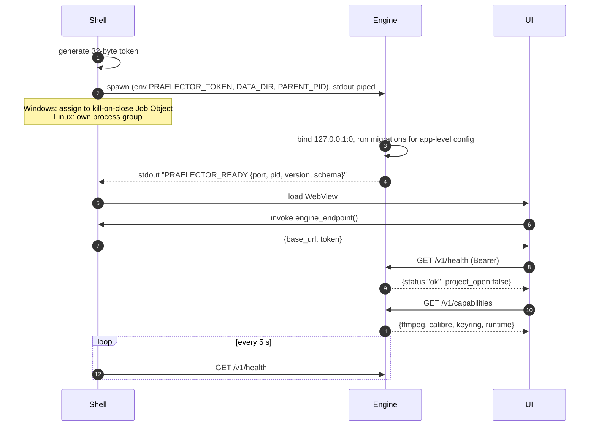
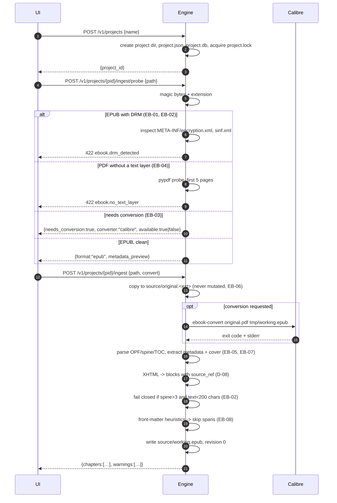
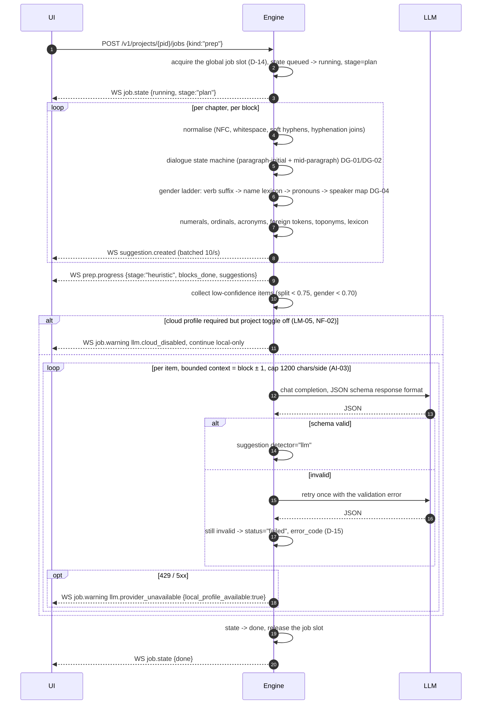
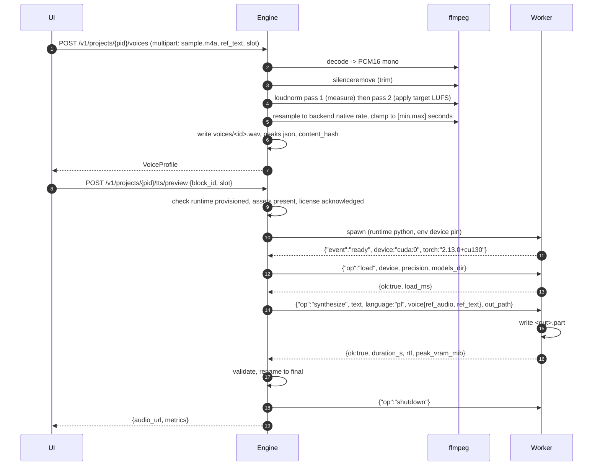
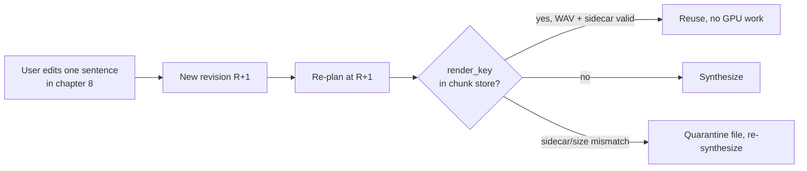
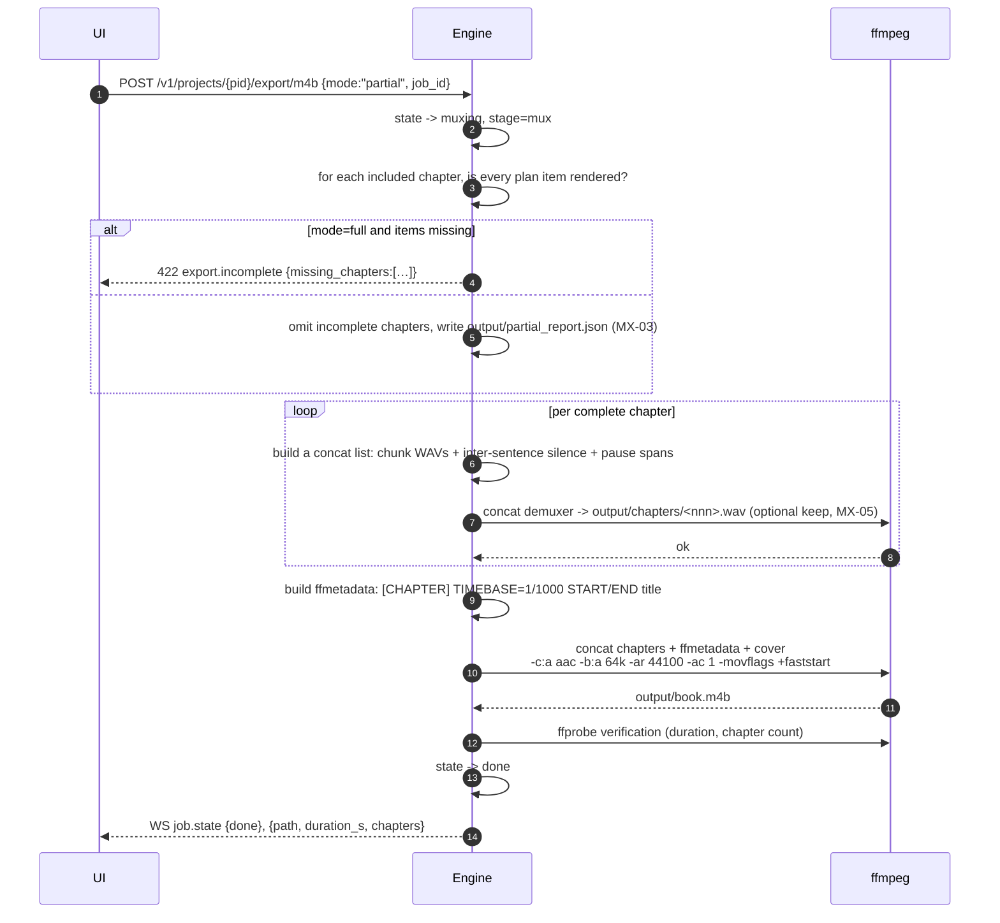
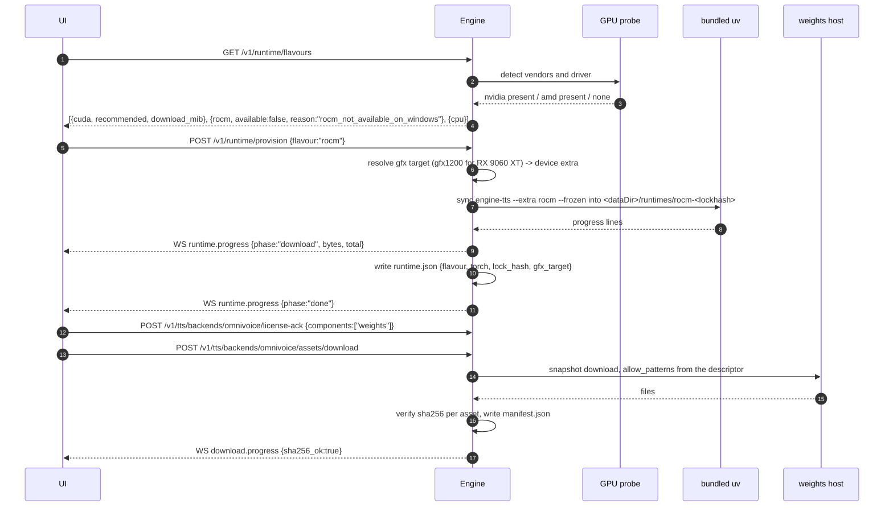
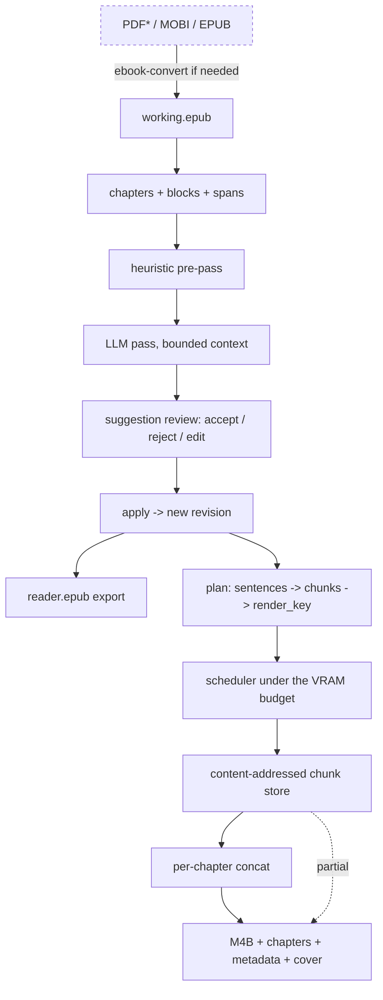

# Praelector — Sequence Diagrams

Flows referenced by [PLAN.md](PLAN.md). Participants: **UI** (React), **Shell** (Tauri/Rust), **Engine** (FastAPI core), **Worker** (TTS process), **ffmpeg**, **LLM** (Ollama/LM Studio/cloud), **Calibre** (`ebook-convert`).

---

## 1. Startup and sidecar handshake



Failure branches: no READY line within 30 s, or three consecutive failed health polls, ⇒ kill, backoff, restart; more than five restarts in ten minutes ⇒ fatal panel with the last 200 log lines (PLAN §1.6).

---

## 2. Ingest (EB-01…EB-08)



---

## 3. Preparation pipeline: heuristics then LLM (AI-01…AI-03, DG-01…DG-05)



---

## 4. Review and apply (AI-04…AI-07, EX-01)

```mermaid
sequenceDiagram
    autonumber
    participant UI
    participant Engine

    UI->>Engine: GET /v1/projects/{pid}/suggestions?category=dialogue_split&status=pending
    Engine-->>UI: page of suggestions with context windows
    UI->>Engine: PATCH /v1/suggestions/{sid} {status:"edited", proposed:"Łoker"}
    UI->>Engine: POST /v1/projects/{pid}/suggestions/bulk {filter:{category:"numeral"}, action:"accept"}
    Engine-->>UI: {batch_id, affected: 214}

    UI->>Engine: POST /v1/projects/{pid}/suggestions/apply
    Engine->>Engine: open revision R+1
    loop per block, suggestions sorted by start DESC
        Engine->>Engine: original still matches? else -> conflicts[]
        Engine->>Engine: pronunciation -> new span; artifact -> rewrite block.text + remap
        Engine->>Engine: dialogue_split -> retile spans; speaker_gender -> set gender
    end
    Engine->>Engine: close old block/span versions at R, insert new at R+1 (SCD-2)
    Engine->>Engine: project.current_revision = R+1
    Engine-->>UI: {revision:R+1, applied:214, conflicts:[]}
    Engine-->>UI: WS project.revision {revision:R+1}

    opt undo (AI-06)
        UI->>Engine: POST /v1/projects/{pid}/suggestions/undo {batch_id}
        Engine->>Engine: restore current_revision = R, mark batch reverted
    end

    UI->>Engine: POST /v1/projects/{pid}/export/epub {variant:"reader"}
    Engine->>Engine: write data-prl-* spans + prl-spans.json companion (EX-01)
    Engine-->>UI: {path:"reader/reader-2026-09-13.epub"}
```

---

## 5. Voice ingest and preview (TTS-04, TTS-09)



---

## 6. Recording job with admission control, pause and resume (JB-01…JB-07, GPU-04, GPU-05)

```mermaid
sequenceDiagram
    autonumber
    participant UI
    participant Engine
    participant GPU as GPU probe
    participant W1 as Worker 1
    participant W2 as Worker 2

    UI->>Engine: POST /v1/projects/{pid}/jobs {kind:"record", options}
    Engine->>Engine: preflight: voices resolved, language in backend.capabilities.languages (D-17),<br/>runtime ready, ffmpeg present
    Engine->>Engine: plan: blocks -> spans -> sentences -> chunks, compute render_key each
    Engine->>Engine: write plan.jsonl; mark items whose chunk already exists as reused (JB-05)
    Engine->>GPU: sample total/free VRAM
    GPU-->>Engine: total 12288, free 11000
    Engine->>Engine: reserve = max(ceil(0.2*12288),1536) = 2458<br/>max_workers = max(1, floor((11000-2458)/3500)) = 2
    Engine-->>UI: WS job.state {running, stage:"synth"}, budget snapshot

    par worker 1
        Engine->>W1: spawn + load + synthesize(ordinal 403)
        W1-->>Engine: {duration_s, rtf, peak_vram_mib}
        Engine->>Engine: atomic rename + sidecar, append events.jsonl
        Engine-->>UI: WS job.chunk, job.progress (<= 4 Hz)
    and worker 2
        Engine->>W2: spawn + load + synthesize(ordinal 404)
        W2-->>Engine: {duration_s, rtf}
    end

    loop every 1 s
        Engine->>GPU: sample free VRAM
        Engine-->>UI: WS gpu.sample {vram_used, workers_active}
        alt free_now - reserve < peak_worker
            Engine->>Engine: admissions_paused = true (GPU-05), running workers finish
        else headroom restored for 3 samples
            Engine->>Engine: admissions_paused = false
        end
    end

    UI->>Engine: POST /v1/jobs/{jid}/pause
    Engine->>Engine: stop admitting; pause_mode=finish_current
    W1-->>Engine: final chunk result
    Engine->>W2: shutdown (discard .part)
    Engine->>Engine: write job.json atomically, state=paused (JB-03)

    Note over Engine: process killed / power loss
    Engine->>Engine: on open: job.state in {running,muxing} -> paused,<br/>paused_reason="crash_recovery" (JB-07)
    Engine->>Engine: reconcile chunk index from sidecars (D-02)

    UI->>Engine: POST /v1/jobs/{jid}/resume
    Engine->>Engine: re-plan at the current revision; reuse every matching render_key
    Engine-->>UI: WS job.progress {chunks_reused: 402}
```

Chunk invalidation on resume, illustrated:



---

## 7. Mux to M4B, full and partial (MX-01…MX-04)



---

## 8. TTS runtime provisioning (D-04, GPU-07)



---

## 9. End-to-end book flow



`*` PDF only with a text layer; no OCR in v1 (EB-04).
